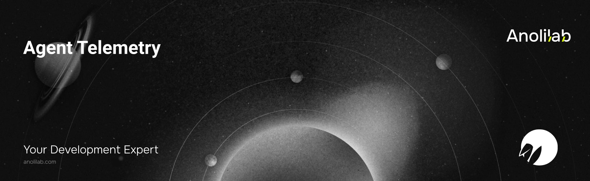

<!-- START_PACKAGE_OG_IMAGE_PLACEHOLDER -->

<a href="https://www.anolilab.com/open-source" align="center">

  

</a>

<h3 align="center">Observability integrations for @lunora/agent: zero-dependency console tracer plus dependency-injected Sentry and Braintrust bridges that plug into the ai@7 telemetry surface</h3>

<!-- END_PACKAGE_OG_IMAGE_PLACEHOLDER -->

<br />

<div align="center">

[![typescript-image][typescript-badge]][typescript-url]
[![FSL-1.1-Apache-2.0 licence][license-badge]][license]
[![npm version][npm-version-badge]][npm-version]
[![npm downloads][npm-downloads-badge]][npm-downloads]
[![PRs Welcome][prs-welcome-badge]][prs-welcome]

</div>

---

<div align="center">
    <p>
        <sup>
            Daniel Bannert's open source work is supported by the community on <a href="https://github.com/sponsors/prisis">GitHub Sponsors</a>
        </sup>
    </p>
</div>

---

Observability for [`@lunora/agent`](https://www.npmjs.com/package/@lunora/agent). Each export produces an [Vercel AI SDK](https://sdk.vercel.ai) `Telemetry` integration you drop into an agent's `telemetry.integrations`, so every LLM turn and tool call in the durable agent loop is traced — to your console, to Sentry, or to Braintrust.

Part of the [Lunora](https://github.com/anolilab/lunora) framework — a type-safe, real-time backend on Cloudflare Workers + Durable Objects with a Vite-first DX.

## Why this package

`@lunora/agent` compiles the agent tool-loop onto Cloudflare Workflows and passes an ai@7 `TelemetryOptions` straight through to `generateText`. That gives you a vendor-neutral `integrations: Telemetry[]` seam. This package fills it with batteries-included tracers:

- **`consoleTelemetry`** — a **zero-dependency** structured console tracer. Perfect for local dev and Worker `console`/tail logs.
- **`combineTelemetry`** — fan the whole lifecycle out to several integrations at once and correctly **nest** their span wrappers.
- **`sentryTelemetry`** / **`braintrustTelemetry`** — bridges to [Sentry](https://sentry.io) and [Braintrust](https://www.braintrust.dev). They are **dependency-injected**: you pass your already-initialized SDK in, so this package never imports the heavy vendor SDK and stays install-light and version-agnostic.

### Privacy-safe by default

Every integration takes `recordInputs` and `recordOutputs`, both defaulting to **`false`**. Without an explicit opt-in nothing sensitive — no prompt, message, tool argument, generated text, or tool result — is forwarded to a tracer. Only structural metadata (model id, finish reason, token counts, tool name, timing, success/failure) is recorded. Turn recording on deliberately, per integration.

## Install

```sh
npm install @lunora/agent-telemetry
```

```sh
pnpm add @lunora/agent-telemetry
```

`consoleTelemetry` and `combineTelemetry` have zero runtime dependencies. `sentryTelemetry` and `braintrustTelemetry` expect you to pass in your own Sentry namespace / Braintrust logger, so install those SDKs only if you use those bridges.

## Usage

Wire an integration into your agent's `telemetry` (the same `TelemetryOptions` the AI SDK's `generateText` accepts):

```ts
import { defineAgent } from "@lunora/agent";
import { consoleTelemetry } from "@lunora/agent-telemetry";

export const support = defineAgent({
    name: "support",
    telemetry: {
        isEnabled: true,
        integrations: [consoleTelemetry({ functionId: "support" })],
    },
    // ...model, tools, loop control
});
```

### Combine several tracers

`combineTelemetry` returns a single `Telemetry` that fans every lifecycle callback out to all integrations and nests the two execution wrappers (`executeLanguageModelCall`, `executeTool`) right-to-left, so multiple span-context wrappers compose correctly. The first integration ends up outermost.

```ts
import { combineTelemetry, consoleTelemetry, sentryTelemetry } from "@lunora/agent-telemetry";
import * as Sentry from "@sentry/cloudflare";

telemetry: {
    isEnabled: true,
    integrations: [combineTelemetry(sentryTelemetry({ Sentry }), consoleTelemetry())],
}
```

### Sentry (dependency-injected)

Pass your initialized Sentry namespace as `Sentry`. Model calls and tool executions become Sentry spans (`op: "gen_ai.generate"` / `"gen_ai.execute_tool"`) so nested provider/tool work is correctly parented, and errors route to `Sentry.captureException`.

```ts
import { sentryTelemetry } from "@lunora/agent-telemetry";
import * as Sentry from "@sentry/cloudflare";

const integration = sentryTelemetry({ Sentry, functionId: "support" });
```

### Braintrust (dependency-injected)

Pass your initialized Braintrust logger as `logger`. Model calls (`type: "llm"`) and tool executions (`type: "tool"`) become `logger.traced` spans.

```ts
import { braintrustTelemetry } from "@lunora/agent-telemetry";
import { initLogger } from "braintrust";

const logger = initLogger({ projectName: "support" });
const integration = braintrustTelemetry({ logger, recordInputs: true, recordOutputs: true });
```

## API

| Export                                     | Kind  | Notes                                                                                      |
| ------------------------------------------ | ----- | ------------------------------------------------------------------------------------------ |
| `consoleTelemetry(options?)`               | value | Zero-dependency structured console tracer. Options: `logger`, `functionId`, privacy flags. |
| `combineTelemetry(...integrations)`        | value | Fans callbacks to all; nests the two wrappers right-to-left.                               |
| `sentryTelemetry({ Sentry, ...options })`  | value | Dependency-injected Sentry bridge. `Sentry` is your initialized namespace.                 |
| `braintrustTelemetry({ logger, ...opts })` | value | Dependency-injected Braintrust bridge. `logger` is your initialized logger.                |
| `SentryLike` / `BraintrustLike`            | type  | The minimal structural slice of each SDK the bridges depend on.                            |
| `CommonOptions`                            | type  | `{ recordInputs?, recordOutputs? }`, both default `false`.                                 |

## Related packages

- [`@lunora/agent`](https://www.npmjs.com/package/@lunora/agent) — the durable agent runtime whose `telemetry.integrations` these plug into.
- [`@lunora/ai`](https://www.npmjs.com/package/@lunora/ai) — the Workers AI helper on the Vercel AI SDK.

## Supported Node.js Versions

Libraries in this ecosystem make the best effort to track [Node.js' release schedule](https://github.com/nodejs/release#release-schedule).
Here's [a post on why we think this is important](https://medium.com/the-node-js-collection/maintainers-should-consider-following-node-js-release-schedule-ab08ed4de71a).

## Contributing

If you would like to help take a look at the [list of issues](https://github.com/anolilab/lunora/issues) and check our [Contributing](https://github.com/anolilab/lunora/blob/alpha/.github/CONTRIBUTING.md) guidelines.

> **Note:** please note that this project is released with a Contributor Code of Conduct. By participating in this project you agree to abide by its terms.

## Credits

- [Daniel Bannert](https://github.com/prisis)
- [All Contributors](https://github.com/anolilab/lunora/graphs/contributors)

## Made with ❤️ at Anolilab

This is an open source project and will always remain free to use. If you think it's cool, please star it 🌟. [Anolilab](https://www.anolilab.com/open-source) is a Development and AI Studio. Contact us at [hello@anolilab.com](mailto:hello@anolilab.com) if you need any help with these technologies or just want to say hi!

## License

The Lunora agent-telemetry package is open-sourced software licensed under the [FSL-1.1-Apache-2.0][license].

<!-- badges -->

[license-badge]: https://img.shields.io/badge/license-FSL--1.1--Apache--2.0-blue.svg?style=for-the-badge
[license]: https://github.com/anolilab/lunora/blob/alpha/LICENSE.md
[npm-version-badge]: https://img.shields.io/npm/v/@lunora/agent-telemetry?style=for-the-badge
[npm-version]: https://www.npmjs.com/package/@lunora/agent-telemetry
[npm-downloads-badge]: https://img.shields.io/npm/dm/@lunora/agent-telemetry?style=for-the-badge
[npm-downloads]: https://www.npmjs.com/package/@lunora/agent-telemetry
[prs-welcome-badge]: https://img.shields.io/badge/PRs-welcome-brightgreen.svg?style=for-the-badge
[prs-welcome]: https://github.com/anolilab/lunora/blob/alpha/.github/CONTRIBUTING.md
[typescript-badge]: https://img.shields.io/badge/Typescript-294E80.svg?style=for-the-badge&logo=typescript
[typescript-url]: https://www.typescriptlang.org/
