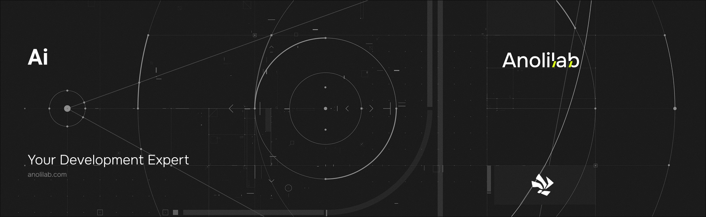

<!-- START_PACKAGE_OG_IMAGE_PLACEHOLDER -->

<a href="https://www.anolilab.com/open-source" align="center">

  

</a>

<h3 align="center">Workers AI helper for Lunora: provider-agnostic AI SDK access from functions, Workers AI by default</h3>

<!-- END_PACKAGE_OG_IMAGE_PLACEHOLDER -->

> **Experimental** — this package is outside the Lunora 1.0 stability promise: its API may change in any release, without a major version bump.

<br />

<div align="center">

[![typescript-image][typescript-badge]][typescript-url]
[![FSL-1.1-Apache-2.0 licence][license-badge]][license]
[![npm version][npm-version-badge]][npm-version]
[![npm downloads][npm-downloads-badge]][npm-downloads]
[![PRs Welcome][prs-welcome-badge]][prs-welcome]

</div>

---

<div align="center">
    <p>
        <sup>
            Daniel Bannert's open source work is supported by the community on <a href="https://github.com/sponsors/prisis">GitHub Sponsors</a>
        </sup>
    </p>
</div>

---

A small AI helper for Lunora, built on the [Vercel AI SDK](https://ai-sdk.dev) v6 core and Cloudflare's official [`workers-ai-provider`](https://github.com/cloudflare/ai). Call `generateText`/`streamText`/`generateObject`/`embed`/`tool` from any function handler. **Cloudflare Workers AI is the zero-config default**, but the helper is provider-agnostic: every call takes either a Workers AI model id (a string) or any AI SDK model object — `@ai-sdk/openai`, `@ai-sdk/anthropic`, OpenRouter, … — so apps are never locked to Workers AI. Pair `embed` with [`@lunora/bindings/vectors`](https://www.npmjs.com/package/@lunora/bindings) for RAG.

Part of the [Lunora](https://github.com/anolilab/lunora) framework — a type-safe, real-time backend on Cloudflare Workers + Durable Objects with a Vite-first DX.

## Install

```sh
npm install @lunora/ai
```

```sh
yarn add @lunora/ai
```

```sh
pnpm add @lunora/ai
```

To use another provider, install it alongside (optional): `pnpm add @ai-sdk/openai`.

## Usage

When a function uses AI, codegen wires a typed **`ctx.ai`** onto the action context (inference is an external call, so — like `ctx.fetch` — it lives on actions). Workers AI is the zero-config default; pass any AI SDK model to use another provider.

```ts
// lunora/summarize.ts — ctx.ai (codegen-wired), Workers AI by default
import { action, v } from "@/lunora/_generated/server";
import { generateText } from "@lunora/ai";

export const summarize = action.input({ text: v.string() }).action(async ({ args: { text }, ctx }) => {
    const { text: summary } = await generateText({
        model: ctx.ai.model("@cf/meta/llama-3.3-70b-instruct-fp8-fast"),
        prompt: `Summarize:\n\n${text}`,
    });

    return summary;
});
```

```ts
// Bring-your-own provider — same call surface, no lock-in
import { streamText } from "@lunora/ai";
import { openai } from "@ai-sdk/openai";

const result = streamText({ model: openai("gpt-5"), messages });
```

```ts
// RAG: embed via ctx.ai, store/search with @lunora/bindings/vectors (ctx.vectors)
import { embed } from "@lunora/ai";

const { embedding } = await embed({ model: ctx.ai.embeddingModel("@cf/baai/bge-base-en-v1.5"), value: text });
await ctx.vectors.upsert("docs-body", { id, input: text, embed: async () => embedding });
```

Outside an action — in the worker entry, a Durable Object, or a queue/scheduled handler — build the helper directly with `createAi({ binding: env.AI })`. The raw binding escape hatch (`ctx.ai.run(model, inputs)`) covers Workers-AI-only model families (image, ASR, translation) not surfaced through the AI SDK provider.

> This README covers the basics. For the full API, options, and guides, see the **[documentation](https://lunora.sh/docs)**.

## Related

- [`@lunora/server`](https://www.npmjs.com/package/@lunora/server) — function primitives whose `ctx.ai` this package backs.
- [`@lunora/bindings/vectors`](https://www.npmjs.com/package/@lunora/bindings) — pair `embed` with Vectorize for RAG.
- [`@lunora/vite`](https://www.npmjs.com/package/@lunora/vite) — infers and reconciles the `AI` binding into `wrangler.jsonc`.

## Supported Node.js Versions

Libraries in this ecosystem make the best effort to track [Node.js' release schedule](https://github.com/nodejs/release#release-schedule).
Here's [a post on why we think this is important](https://medium.com/the-node-js-collection/maintainers-should-consider-following-node-js-release-schedule-ab08ed4de71a).

## Contributing

If you would like to help take a look at the [list of issues](https://github.com/anolilab/lunora/issues) and check our [Contributing](https://github.com/anolilab/lunora/blob/alpha/.github/CONTRIBUTING.md) guidelines.

> **Note:** please note that this project is released with a Contributor Code of Conduct. By participating in this project you agree to abide by its terms.

## Credits

- [Daniel Bannert](https://github.com/prisis)
- [All Contributors](https://github.com/anolilab/lunora/graphs/contributors)

## Made with ❤️ at Anolilab

This is an open source project and will always remain free to use. If you think it's cool, please star it 🌟. [Anolilab](https://www.anolilab.com/open-source) is a Development and AI Studio. Contact us at [hello@anolilab.com](mailto:hello@anolilab.com) if you need any help with these technologies or just want to say hi!

## License

The Lunora ai package is open-sourced software licensed under the [FSL-1.1-Apache-2.0][license].

<!-- badges -->

[license-badge]: https://img.shields.io/badge/license-FSL--1.1--Apache--2.0-blue.svg?style=for-the-badge
[license]: https://github.com/anolilab/lunora/blob/alpha/LICENSE.md
[npm-version-badge]: https://img.shields.io/npm/v/@lunora/ai?style=for-the-badge
[npm-version]: https://www.npmjs.com/package/@lunora/ai
[npm-downloads-badge]: https://img.shields.io/npm/dm/@lunora/ai?style=for-the-badge
[npm-downloads]: https://www.npmjs.com/package/@lunora/ai
[prs-welcome-badge]: https://img.shields.io/badge/PRs-welcome-brightgreen.svg?style=for-the-badge
[prs-welcome]: https://github.com/anolilab/lunora/blob/alpha/.github/CONTRIBUTING.md
[typescript-badge]: https://img.shields.io/badge/Typescript-294E80.svg?style=for-the-badge&logo=typescript
[typescript-url]: https://www.typescriptlang.org/
