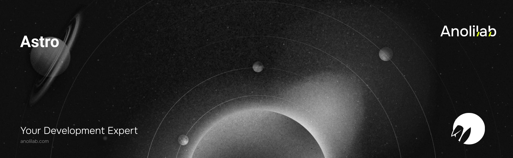

<!-- START_PACKAGE_OG_IMAGE_PLACEHOLDER -->

<a href="https://www.anolilab.com/open-source" align="center">

  

</a>

<h3 align="center">Astro integration for Lunora — single-worker composition plus reactive-loader server helpers</h3>

<!-- END_PACKAGE_OG_IMAGE_PLACEHOLDER -->

<br />

<div align="center">

[![typescript-image][typescript-badge]][typescript-url]
[![FSL-1.1-Apache-2.0 licence][license-badge]][license]
[![npm version][npm-version-badge]][npm-version]
[![npm downloads][npm-downloads-badge]][npm-downloads]
[![PRs Welcome][prs-welcome-badge]][prs-welcome]

</div>

---

<div align="center">
    <p>
        <sup>
            Daniel Bannert's open source work is supported by the community on <a href="https://github.com/sponsors/prisis">GitHub Sponsors</a>
        </sup>
    </p>
</div>

---

The Astro integration for Lunora. Astro is multi-framework at the UI layer, so this is not a new reactive runtime — reactivity comes from whichever island adapter you hydrate with. Instead it owns two server-side seams: `withLunora` for single-worker composition inside Astro's `@astrojs/cloudflare` worker, and the reactive-loader server helpers in `@lunora/astro/server` for preloading queries in `.astro` frontmatter.

Part of the [Lunora](https://github.com/anolilab/lunora) framework — a type-safe, real-time backend on Cloudflare Workers + Durable Objects with a Vite-first DX.

## Install

```sh
npm install @lunora/astro
```

```sh
yarn add @lunora/astro
```

```sh
pnpm add @lunora/astro
```

## Usage

Add the integration to `astro.config`, then wrap the Cloudflare adapter's SSR handler so Lunora mounts under `/_lunora/*`:

```ts
// astro.config.mjs
import cloudflare from "@astrojs/cloudflare";
import { defineConfig } from "astro/config";
import { lunora } from "@lunora/astro";

export default defineConfig({
    output: "server",
    adapter: cloudflare(),
    integrations: [lunora()],
});
```

```ts
// src/worker.ts — the composed worker's `export default`.
import { handle } from "@astrojs/cloudflare/handler";
import { withLunora } from "@lunora/astro";

// `SHARD` lives on `env` (per request), so pass an `(env) => options` factory.
export default withLunora(
    (request, env, ctx) => handle(request, env, ctx),
    (env) => ({ shardDO: env.SHARD }),
);
```

Set `"main": "src/worker.ts"` in `wrangler.jsonc` so wrangler bundles this entry. `withLunora` reserves `/_lunora/rpc`, `/_lunora/ws`, and `/_lunora/admin/*` for the realtime plane; every other request falls through to Astro's SSR handler. An Astro render that throws is contained at the seam as a plain 500 — it can't take down realtime.

Reactivity comes from the island adapter you hydrate with, not from this package. Preload a query in `.astro` frontmatter or a server endpoint with `@lunora/astro/server`, then hand the token to that adapter's `hydratePreloaded`:

```astro
---
// src/pages/index.astro
import { createServerClient, preloadQuery, serializePreloaded } from "@lunora/astro/server";
import { api } from "../lunora/_generated/api";

const client = createServerClient({ url: Astro.url.origin });
const preloaded = await preloadQuery(client, api.messages.list, {});
---

<script id="preloaded" type="application/json" set:html={serializePreloaded(preloaded)}></script>
<my-island></my-island>
```

### Feature flags

`@lunora/astro` ships no flag hook — like every other surface, flags follow the same server/island split. Read `ctx.flags` server-side (a server endpoint, a function, or the same `.astro` frontmatter) and hand the resolved value to the island, or call `useFlag` inside the island itself via the adapter you hydrate with (`@lunora/react`, `@lunora/vue`, …). Requires [`@lunora/flags`](https://www.npmjs.com/package/@lunora/flags) wired in `lunora/flags.ts`.

```astro
---
// src/pages/index.astro — resolve the flag once, server-side
import { createServerClient, preloadQuery, preloadedQueryResult } from "@lunora/astro/server";
import { api } from "../lunora/_generated/api";

const client = createServerClient({ url: Astro.url.origin });
const preloaded = await preloadQuery(client, api.homepage.heroFlag, {}); // a query that returns ctx.flags.boolean(...)
const newHero = preloadedQueryResult(preloaded);
---

{newHero ? <NewHero client:load /> : <ClassicHero client:load />}
```

> This README covers the basics. For the full API, options, and guides, see the **[documentation](https://lunora.sh/docs/frameworks/bring-your-framework)**.

## Related

- `@lunora/client/ssr` — the server preload contract re-exported by `@lunora/astro/server`.
- [`@lunora/runtime`](https://www.npmjs.com/package/@lunora/runtime) — the Worker runtime `withLunora` composes with.
- [`@lunora/react`](https://www.npmjs.com/package/@lunora/react) — an island adapter for hydrating preloaded queries live.
- [`@lunora/solid`](https://www.npmjs.com/package/@lunora/solid) — another island adapter for live hydration.

## Supported Node.js Versions

Libraries in this ecosystem make the best effort to track [Node.js' release schedule](https://github.com/nodejs/release#release-schedule).
Here's [a post on why we think this is important](https://medium.com/the-node-js-collection/maintainers-should-consider-following-node-js-release-schedule-ab08ed4de71a).

## Contributing

If you would like to help take a look at the [list of issues](https://github.com/anolilab/lunora/issues) and check our [Contributing](https://github.com/anolilab/lunora/blob/alpha/.github/CONTRIBUTING.md) guidelines.

> **Note:** please note that this project is released with a Contributor Code of Conduct. By participating in this project you agree to abide by its terms.

## Credits

- [Daniel Bannert](https://github.com/prisis)
- [All Contributors](https://github.com/anolilab/lunora/graphs/contributors)

## Made with ❤️ at Anolilab

This is an open source project and will always remain free to use. If you think it's cool, please star it 🌟. [Anolilab](https://www.anolilab.com/open-source) is a Development and AI Studio. Contact us at [hello@anolilab.com](mailto:hello@anolilab.com) if you need any help with these technologies or just want to say hi!

## License

The Lunora astro package is open-sourced software licensed under the [FSL-1.1-Apache-2.0][license].

<!-- badges -->

[license-badge]: https://img.shields.io/badge/license-FSL--1.1--Apache--2.0-blue.svg?style=for-the-badge
[license]: https://github.com/anolilab/lunora/blob/alpha/LICENSE.md
[npm-version-badge]: https://img.shields.io/npm/v/@lunora/astro?style=for-the-badge
[npm-version]: https://www.npmjs.com/package/@lunora/astro
[npm-downloads-badge]: https://img.shields.io/npm/dm/@lunora/astro?style=for-the-badge
[npm-downloads]: https://www.npmjs.com/package/@lunora/astro
[prs-welcome-badge]: https://img.shields.io/badge/PRs-welcome-brightgreen.svg?style=for-the-badge
[prs-welcome]: https://github.com/anolilab/lunora/blob/alpha/.github/CONTRIBUTING.md
[typescript-badge]: https://img.shields.io/badge/Typescript-294E80.svg?style=for-the-badge&logo=typescript
[typescript-url]: https://www.typescriptlang.org/
