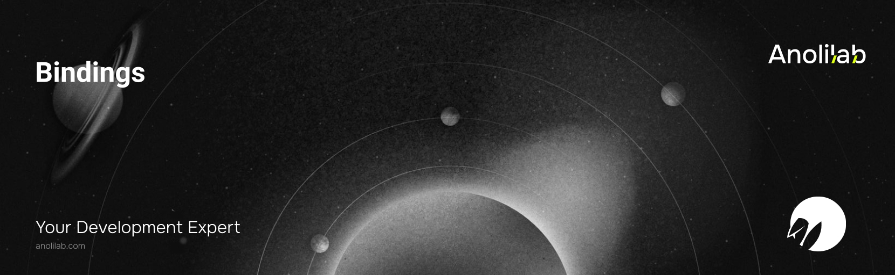

<!-- START_PACKAGE_OG_IMAGE_PLACEHOLDER -->

<a href="https://www.anolilab.com/open-source" align="center">

  

</a>

<h3 align="center">Lightweight Cloudflare binding helpers for Lunora — ctx.kv, ctx.images, ctx.analytics (+ Pipelines), ctx.vectors, ctx.r2sql — one install, per-binding subpaths</h3>

<!-- END_PACKAGE_OG_IMAGE_PLACEHOLDER -->

# @lunora/bindings

The lightweight Cloudflare binding helpers for Lunora, in one install with
per-binding subpaths — each is a thin, zero-dependency `ctx.*` facade over its
Cloudflare binding:

| Subpath                      | `ctx.*`         | Cloudflare binding                             |
| ---------------------------- | --------------- | ---------------------------------------------- |
| `@lunora/bindings/kv`        | `ctx.kv`        | Workers KV                                     |
| `@lunora/bindings/images`    | `ctx.images`    | Cloudflare Images                              |
| `@lunora/bindings/analytics` | `ctx.analytics` | Analytics Engine + Pipelines (`ctx.pipelines`) |
| `@lunora/bindings/vectors`   | `ctx.vectors`   | Vectorize                                      |
| `@lunora/bindings/r2sql`     | `ctx.r2sql`     | R2 SQL                                         |

```ts
import { createKv } from "@lunora/bindings/kv";
import { createImages } from "@lunora/bindings/images";
```

Subpath exports keep tree-shaking per-binding (`sideEffects: false`), so an app
that imports only `@lunora/bindings/kv` bundles nothing else. Heavier add-ons
with framework/driver peer deps (`@lunora/browser`, `@lunora/hyperdrive`,
`@lunora/ai`, …) stay separate installs.

## License

The lunora `@lunora/bindings` package is open-sourced software licensed under
the [FSL-1.1-Apache-2.0 license](./LICENSE.md).
