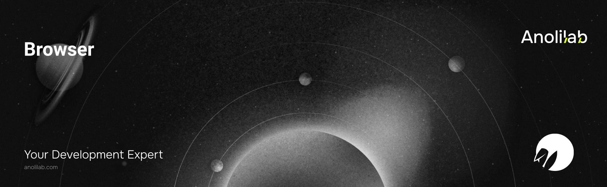

<!-- START_PACKAGE_OG_IMAGE_PLACEHOLDER -->

<a href="https://www.anolilab.com/open-source" align="center">

  

</a>

<h3 align="center">Cloudflare Browser Rendering for Lunora: ctx.browser screenshots, PDF, and scraping in actions</h3>

<!-- END_PACKAGE_OG_IMAGE_PLACEHOLDER -->

> **Experimental** — this package is outside the Lunora 1.0 stability promise: its API may change in any release, without a major version bump.

<br />

<div align="center">

[![typescript-image][typescript-badge]][typescript-url]
[![FSL-1.1-Apache-2.0 licence][license-badge]][license]
[![npm version][npm-version-badge]][npm-version]
[![npm downloads][npm-downloads-badge]][npm-downloads]
[![PRs Welcome][prs-welcome-badge]][prs-welcome]

</div>

---

<div align="center">
    <p>
        <sup>
            Daniel Bannert's open source work is supported by the community on <a href="https://github.com/sponsors/prisis">GitHub Sponsors</a>
        </sup>
    </p>
</div>

---

Cloudflare [Browser Rendering](https://developers.cloudflare.com/browser-rendering/) for Lunora. Wraps the `env.BROWSER` binding — driven through [`@cloudflare/playwright`](https://github.com/cloudflare/playwright) (`launch(env.BROWSER)`) — with a small typed `ctx.browser` API: `screenshot`, `pdf`, `scrape`/`content`, plus a low-level `launch()` escape hatch. Every helper opens a context + page, navigates, performs the op, and **always closes the session in a `finally`** (a leaked Browser Rendering session is billed and rate-limited).

Part of the [Lunora](https://github.com/anolilab/lunora) framework — a type-safe, real-time backend on Cloudflare Workers + Durable Objects with a Vite-first DX.

## Action-only — and why

`ctx.browser` is wired onto the **action context only** — never `QueryCtx`/`MutationCtx`. Driving a real headless browser to a URL is **non-deterministic network I/O** (the same class as `fetch`), and Lunora queries/mutations must be deterministic so they can be re-run, cached, and replayed over the live channel. So codegen weaves `ctx.browser` into `ActionCtx` exclusively — exactly like `ctx.ai` / `ctx.fetch`.

This isn't just convention: because the `browser` type is **not on** `QueryCtx`/`MutationCtx`, a `ctx.browser.*` call in a query or mutation is a type error and won't compile. It's the same mistake class the [`nondeterministic_query_mutation` advisor](https://github.com/anolilab/lunora/blob/alpha/packages/advisor/src/lints/static/nondeterministic-query-mutation.ts) flags for `fetch`/`Date.now`/`Math.random` — here it's structurally impossible.

## Install

`@cloudflare/playwright` is an **optional peer dependency** (it bundles a chromium-protocol shim — apps that never screenshot shouldn't pay for it). Install both:

```sh
npm install @lunora/browser @cloudflare/playwright
```

```sh
pnpm add @lunora/browser @cloudflare/playwright
```

Add the binding to your `wrangler.jsonc` (the Lunora Vite plugin / CLI infers and reconciles it for you when it sees a `@lunora/browser` import):

```jsonc
{
    "browser": { "binding": "BROWSER" },
}
```

## Usage

```ts
import { action, v } from "@/lunora/_generated/server";

export const screenshotPage = action.input({ url: v.string() }).action(async ({ args: { url }, ctx }) => {
    // ctx.browser is wired automatically — action context only.
    const png = await ctx.browser.screenshot(url, { fullPage: true });

    const { key } = await ctx.storage.store(`shots/${crypto.randomUUID()}.png`, png.buffer, {
        contentType: "image/png",
    });

    return ctx.storage.getUrl(key);
});
```

Outside an action — in the worker entry, a Durable Object, or a queue/scheduled handler — build the helper directly. It is the exact `launch(env.BROWSER)` equivalence, just with the always-close / URL-validation / viewport-cap guards applied. The config thunk codegen uses is `browser: (env) => createBrowser({ binding: env.BROWSER, launch })`:

```ts
import { launch } from "@cloudflare/playwright";

import { createBrowser } from "@lunora/browser";

const browser = createBrowser({ binding: env.BROWSER, launch });

const pdf = await browser.pdf("https://example.com", { format: "A4", printBackground: true });
const html = await browser.content("https://example.com");
const title = await browser.scrape("https://example.com", () => document.title);
```

## URL safety (SSRF guard)

Every navigation URL is validated before the browser is launched. Beyond rejecting non-`http(s)` schemes (`file:`, `javascript:`, `data:`, …) and embedded `user:pass@` credentials, the helper **default-denies private / internal targets** — loopback (`127.0.0.0/8`, `::1`), RFC1918 (`10/8`, `172.16/12`, `192.168/16`), link-local incl. the cloud-metadata address (`169.254.169.254`), CGNAT (`100.64/10`), IPv6 ULA/link-local, and `localhost` / `*.internal` / `*.local` literals (octal/hex/integer IPv4 and IPv4-mapped IPv6 encodings are normalized first, so they can't slip past). This matters because action `url` args are often caller-controlled. <!-- gitleaks:allow -- illustrative `user:pass@` in prose, not a credential -->

If you deliberately drive the browser at an internal service reachable through a private-network binding / Cloudflare Tunnel, opt out per-factory:

```ts
const browser = createBrowser({ binding: env.BROWSER, launch, allowPrivateTargets: true });
```

Only set `allowPrivateTargets` when every URL is trusted — it re-opens the SSRF surface.

DNS rebinding is covered too: whenever `allowedHosts` is unset, the host is resolved over DoH and refused if it maps to a private address, before the browser launches and again on every redirect hop. Setting `allowedHosts` turns that re-check off, because an exact-host allowlist already closes rebinding and may deliberately name an internal host reachable over a Tunnel; pass `resolveDns: true` to force both.

> This README covers the basics. For the full API, options, and guides, see the **[documentation](https://lunora.sh/docs/packages/browser)**.

## Related

- [`@lunora/server`](https://www.npmjs.com/package/@lunora/server) — call `ctx.browser` from actions.
- [`@lunora/storage`](https://www.npmjs.com/package/@lunora/storage) — persist the screenshots/PDFs you render.
- [`@lunora/advisor`](https://www.npmjs.com/package/@lunora/advisor) — the determinism lint that keeps non-deterministic I/O out of queries/mutations.

## Supported Node.js Versions

Libraries in this ecosystem make the best effort to track [Node.js' release schedule](https://github.com/nodejs/release#release-schedule).
Here's [a post on why we think this is important](https://medium.com/the-node-js-collection/maintainers-should-consider-following-node-js-release-schedule-ab08ed4de71a).

## Contributing

If you would like to help take a look at the [list of issues](https://github.com/anolilab/lunora/issues) and check our [Contributing](https://github.com/anolilab/lunora/blob/alpha/.github/CONTRIBUTING.md) guidelines.

> **Note:** please note that this project is released with a Contributor Code of Conduct. By participating in this project you agree to abide by its terms.

## Credits

- [Daniel Bannert](https://github.com/prisis)
- [All Contributors](https://github.com/anolilab/lunora/graphs/contributors)

## Made with ❤️ at Anolilab

This is an open source project and will always remain free to use. If you think it's cool, please star it 🌟. [Anolilab](https://www.anolilab.com/open-source) is a Development and AI Studio. Contact us at [hello@anolilab.com](mailto:hello@anolilab.com) if you need any help with these technologies or just want to say hi!

## License

The Lunora browser package is open-sourced software licensed under the [FSL-1.1-Apache-2.0][license].

<!-- badges -->

[license-badge]: https://img.shields.io/badge/license-FSL--1.1--Apache--2.0-blue.svg?style=for-the-badge
[license]: https://github.com/anolilab/lunora/blob/alpha/LICENSE.md
[npm-version-badge]: https://img.shields.io/npm/v/@lunora/browser?style=for-the-badge
[npm-version]: https://www.npmjs.com/package/@lunora/browser
[npm-downloads-badge]: https://img.shields.io/npm/dm/@lunora/browser?style=for-the-badge
[npm-downloads]: https://www.npmjs.com/package/@lunora/browser
[prs-welcome-badge]: https://img.shields.io/badge/PRs-welcome-brightgreen.svg?style=for-the-badge
[prs-welcome]: https://github.com/anolilab/lunora/blob/alpha/.github/CONTRIBUTING.md
[typescript-badge]: https://img.shields.io/badge/Typescript-294E80.svg?style=for-the-badge&logo=typescript
[typescript-url]: https://www.typescriptlang.org/
