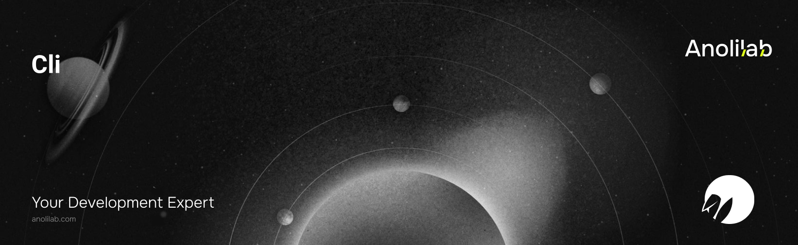

<!-- START_PACKAGE_OG_IMAGE_PLACEHOLDER -->

<a href="https://www.anolilab.com/open-source" align="center">

  

</a>

<h3 align="center">The Lunora CLI: init, dev, deploy, codegen, migrate, seed, doctor, insights, logs, registry, and the rest of the project commands</h3>

<!-- END_PACKAGE_OG_IMAGE_PLACEHOLDER -->

<br />

<div align="center">

[![typescript-image][typescript-badge]][typescript-url]
[![FSL-1.1-Apache-2.0 licence][license-badge]][license]
[![npm version][npm-version-badge]][npm-version]
[![npm downloads][npm-downloads-badge]][npm-downloads]
[![PRs Welcome][prs-welcome-badge]][prs-welcome]

</div>

---

<div align="center">
    <p>
        <sup>
            Daniel Bannert's open source work is supported by the community on <a href="https://github.com/sponsors/prisis">GitHub Sponsors</a>
        </sup>
    </p>
</div>

---

The `lunora` command-line interface. Scaffolds new projects, runs the dev server, regenerates the typed API, validates `wrangler.jsonc`, deploys to Cloudflare, and dispatches one-shot RPC calls against a running Worker — plus `reset` and `migrate`.

Part of the [Lunora](https://github.com/anolilab/lunora) framework — a type-safe, real-time backend on Cloudflare Workers + Durable Objects with a Vite-first DX.

## Install

```sh
npm install @lunora/cli
```

```sh
yarn add @lunora/cli
```

```sh
pnpm add @lunora/cli
```

## Usage

```sh
# Scaffold a new project, then work inside it
lunora init my-app
cd my-app

lunora dev        # run the dev server (Vite + wrangler)
lunora codegen    # re-emit _generated/{api,server,dataModel}.ts
lunora deploy     # codegen + validate wrangler.jsonc + wrangler deploy
```

The CLI also exposes a programmatic entry point:

```ts
import { runCli } from "@lunora/cli";

const exitCode = await runCli({ argv: ["dev", "--no-studio"], cwd: process.cwd() });
```

> This README covers the basics. For the full API, options, and guides, see the **[documentation](https://lunora.sh/docs/api/cli)**.

## Related

- [`@lunora/codegen`](https://www.npmjs.com/package/@lunora/codegen) — the code generator the `codegen`/`deploy` commands call.
- [`@lunora/config`](https://www.npmjs.com/package/@lunora/config) — shared `wrangler.jsonc` validation and `.dev.vars` scaffolding.
- [`@lunora/vite`](https://www.npmjs.com/package/@lunora/vite) — the Vite plugin powering `lunora dev`.

## Supported Node.js Versions

Libraries in this ecosystem make the best effort to track [Node.js' release schedule](https://github.com/nodejs/release#release-schedule).
Here's [a post on why we think this is important](https://medium.com/the-node-js-collection/maintainers-should-consider-following-node-js-release-schedule-ab08ed4de71a).

## Contributing

If you would like to help take a look at the [list of issues](https://github.com/anolilab/lunora/issues) and check our [Contributing](https://github.com/anolilab/lunora/blob/alpha/.github/CONTRIBUTING.md) guidelines.

> **Note:** please note that this project is released with a Contributor Code of Conduct. By participating in this project you agree to abide by its terms.

## Credits

- [Daniel Bannert](https://github.com/prisis)
- [All Contributors](https://github.com/anolilab/lunora/graphs/contributors)

## Made with ❤️ at Anolilab

This is an open source project and will always remain free to use. If you think it's cool, please star it 🌟. [Anolilab](https://www.anolilab.com/open-source) is a Development and AI Studio. Contact us at [hello@anolilab.com](mailto:hello@anolilab.com) if you need any help with these technologies or just want to say hi!

## License

The Lunora cli package is open-sourced software licensed under the [FSL-1.1-Apache-2.0][license].

<!-- badges -->

[license-badge]: https://img.shields.io/badge/license-FSL--1.1--Apache--2.0-blue.svg?style=for-the-badge
[license]: https://github.com/anolilab/lunora/blob/alpha/LICENSE.md
[npm-version-badge]: https://img.shields.io/npm/v/@lunora/cli?style=for-the-badge
[npm-version]: https://www.npmjs.com/package/@lunora/cli
[npm-downloads-badge]: https://img.shields.io/npm/dm/@lunora/cli?style=for-the-badge
[npm-downloads]: https://www.npmjs.com/package/@lunora/cli
[prs-welcome-badge]: https://img.shields.io/badge/PRs-welcome-brightgreen.svg?style=for-the-badge
[prs-welcome]: https://github.com/anolilab/lunora/blob/alpha/.github/CONTRIBUTING.md
[typescript-badge]: https://img.shields.io/badge/Typescript-294E80.svg?style=for-the-badge&logo=typescript
[typescript-url]: https://www.typescriptlang.org/
