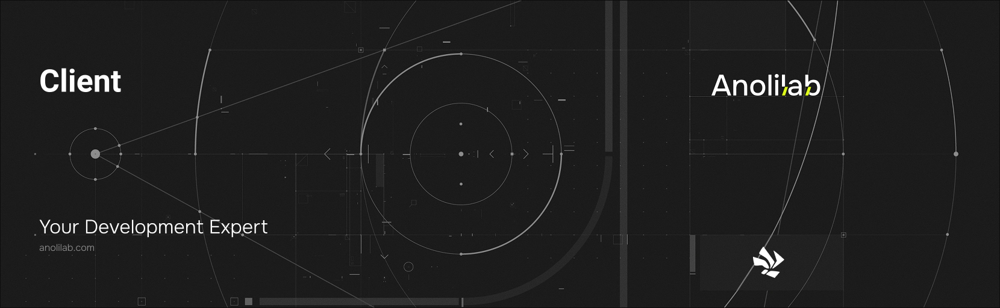

<!-- START_PACKAGE_OG_IMAGE_PLACEHOLDER -->

<a href="https://www.anolilab.com/open-source" align="center">

  

</a>

<h3 align="center">Lunora browser SDK: WebSocket transport, optimistic updates, and an offline mutation queue</h3>

<!-- END_PACKAGE_OG_IMAGE_PLACEHOLDER -->

<br />

<div align="center">

[![typescript-image][typescript-badge]][typescript-url]
[![FSL-1.1-Apache-2.0 licence][license-badge]][license]
[![npm version][npm-version-badge]][npm-version]
[![npm downloads][npm-downloads-badge]][npm-downloads]
[![PRs Welcome][prs-welcome-badge]][prs-welcome]

</div>

---

<div align="center">
    <p>
        <sup>
            Daniel Bannert's open source work is supported by the community on <a href="https://github.com/sponsors/prisis">GitHub Sponsors</a>
        </sup>
    </p>
</div>

---

The framework-agnostic browser/edge SDK for Lunora. It runs RPC over HTTP and real-time deltas over a single multiplexed WebSocket, with optimistic updates, an offline mutation queue, and exponential-backoff-with-jitter reconnect built in. It is the lowest-level user-facing entry point that every framework adapter (React, Vue, Svelte, Solid) layers on top of.

Part of the [Lunora](https://github.com/anolilab/lunora) framework — a type-safe, real-time backend on Cloudflare Workers + Durable Objects with a Vite-first DX.

## Install

```sh
npm install @lunora/client
```

```sh
yarn add @lunora/client
```

```sh
pnpm add @lunora/client
```

## Usage

```ts
import { LunoraClient } from "@lunora/client";
import { api } from "@/lunora/_generated/api";

const client = new LunoraClient({ url: "https://app.acme.test" });

// One-shot query (HTTP, carries the D1 bookmark for read-your-writes).
const messages = await client.query(api.messages.list, { room: "general" });

// Mutation with an optimistic update applied to matching subscribers.
await client.mutation(api.messages.send, { body: "hi" }, { optimistic: (current = []) => [...current, { body: "hi", pending: true }] });

// Live subscription over WS — returns an unsubscribe function.
const unsubscribe = client.subscribe(api.messages.list, { room: "general" }, (next) => {
    console.log("new value", next);
});

client.close();
```

`client.subscribeShape({ name, args }, cb)` is the [local-first sync engine](https://lunora.sh/docs/concepts/local-first)'s parallel to `subscribe`: it replicates a **partial view** of a table (a server-defined shape) over the poke diff protocol instead of re-running a query. Most apps consume it through [`@lunora/db`](https://www.npmjs.com/package/@lunora/db)'s `lunoraCollectionOptions({ shape })` rather than directly.

> This README covers the basics. For the full API, options, and guides, see the **[documentation](https://lunora.sh/docs/api/client)**.

## Related

- [`@lunora/react`](https://www.npmjs.com/package/@lunora/react) — React hooks built on this client.
- `@lunora/client/query` — the shared live-query state machine every UI adapter builds on (subpath of this package).
- `@lunora/client/ssr` — server-side preloading over this client's HTTP transport (subpath of this package).

## Supported Node.js Versions

Libraries in this ecosystem make the best effort to track [Node.js' release schedule](https://github.com/nodejs/release#release-schedule).
Here's [a post on why we think this is important](https://medium.com/the-node-js-collection/maintainers-should-consider-following-node-js-release-schedule-ab08ed4de71a).

## Contributing

If you would like to help take a look at the [list of issues](https://github.com/anolilab/lunora/issues) and check our [Contributing](https://github.com/anolilab/lunora/blob/alpha/.github/CONTRIBUTING.md) guidelines.

> **Note:** please note that this project is released with a Contributor Code of Conduct. By participating in this project you agree to abide by its terms.

## Credits

- [Daniel Bannert](https://github.com/prisis)
- [All Contributors](https://github.com/anolilab/lunora/graphs/contributors)

## Made with ❤️ at Anolilab

This is an open source project and will always remain free to use. If you think it's cool, please star it 🌟. [Anolilab](https://www.anolilab.com/open-source) is a Development and AI Studio. Contact us at [hello@anolilab.com](mailto:hello@anolilab.com) if you need any help with these technologies or just want to say hi!

## License

The Lunora client package is open-sourced software licensed under the [FSL-1.1-Apache-2.0][license].

<!-- badges -->

[license-badge]: https://img.shields.io/badge/license-FSL--1.1--Apache--2.0-blue.svg?style=for-the-badge
[license]: https://github.com/anolilab/lunora/blob/alpha/LICENSE.md
[npm-version-badge]: https://img.shields.io/npm/v/@lunora/client?style=for-the-badge
[npm-version]: https://www.npmjs.com/package/@lunora/client
[npm-downloads-badge]: https://img.shields.io/npm/dm/@lunora/client?style=for-the-badge
[npm-downloads]: https://www.npmjs.com/package/@lunora/client
[prs-welcome-badge]: https://img.shields.io/badge/PRs-welcome-brightgreen.svg?style=for-the-badge
[prs-welcome]: https://github.com/anolilab/lunora/blob/alpha/.github/CONTRIBUTING.md
[typescript-badge]: https://img.shields.io/badge/Typescript-294E80.svg?style=for-the-badge&logo=typescript
[typescript-url]: https://www.typescriptlang.org/
