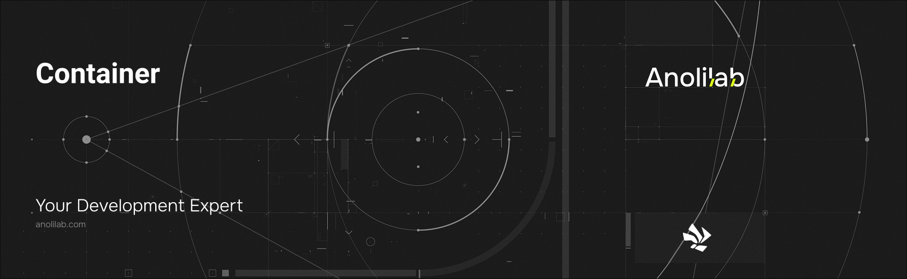

<!-- START_PACKAGE_OG_IMAGE_PLACEHOLDER -->

<a href="https://www.anolilab.com/open-source" align="center">

  

</a>

<h3 align="center">Cloudflare Containers for Lunora: defineContainer, generated Container DO classes, and the ctx.containers action surface</h3>

<!-- END_PACKAGE_OG_IMAGE_PLACEHOLDER -->

> **Experimental** — this package is outside the Lunora 1.0 stability promise: its API may change in any release, without a major version bump.

<br />

<div align="center">

[![typescript-image][typescript-badge]][typescript-url]
[![FSL-1.1-Apache-2.0 licence][license-badge]][license]
[![npm version][npm-version-badge]][npm-version]
[![npm downloads][npm-downloads-badge]][npm-downloads]
[![PRs Welcome][prs-welcome-badge]][prs-welcome]

</div>

---

<div align="center">
    <p>
        <sup>
            Daniel Bannert's open source work is supported by the community on <a href="https://github.com/sponsors/prisis">GitHub Sponsors</a>
        </sup>
    </p>
</div>

---

Cloudflare Containers for Lunora: `defineContainer`, generated Container Durable Object classes, and the `ctx.containers` action surface.

Part of the [Lunora](https://github.com/anolilab/lunora) framework — a type-safe, real-time backend on Cloudflare Workers + Durable Objects with a Vite-first DX.

## Install

```sh
npm install @lunora/container
```

```sh
yarn add @lunora/container
```

```sh
pnpm add @lunora/container
```

## Usage

Declare containers in `lunora/containers.ts`:

```ts
import { defineContainer } from "@lunora/container";

export const transcoder = defineContainer({
    image: "./containers/transcoder", // dir with a Dockerfile, or { registry: "docker.io/acme/transcoder:1.4" }
    defaultPort: 8080,
    instanceType: "standard-1",
    maxInstances: 5,
    sleepAfter: "5m",
    secrets: ["TRANSCODER_API_KEY"], // forwarded from Worker secrets / .dev.vars
    labels: { team: "media" }, // metadata attached to every instance for metrics/observability
});
```

Codegen emits the Container Durable Object class into `_generated/containers.ts` (re-export it from your worker entry) and wires a typed handle onto `ActionCtx`:

```ts
// lunora/transcode.ts — `action` and `v` come from your generated server module.
import { action, v } from "@/lunora/_generated/server";

export const transcode = action.input({ videoId: v.id("videos") }).action(async ({ args: { videoId }, ctx }) => {
    // one instance per entity (same id always routes to the same container)
    const res = await ctx.containers.transcoder.get(videoId).fetch("/transcode", { method: "POST" });

    // a random instance from a fixed pool, for stateless work
    const probe = await ctx.containers.transcoder.any().fetch("/healthz");

    // .pool() is like .any() but retries on another instance on a 5xx / thrown error
    const out = await ctx.containers.transcoder.pool({ attempts: 3 }).fetch("/transcode", { method: "POST" });

    return res.json();
});
```

`.get()` and `.any()` retry the **same** instance through a cold start — when a request lands while Cloudflare is still provisioning (a `503` "no instance", `500` "Failed to start", `429`, or "not listening"), they back off and retry (default 3 attempts) so the provisioning race never reaches your handler. Genuine app `5xx`s pass straight through. Tune or disable per call with `.get(id, { attempts, backoffMs })` (a pre-built `Request` is sent once and not retried, since its body may not be replayable).

`ctx.containers` is action-only (container calls are external I/O, like `ctx.fetch`); `.get(name)` handles also expose `start`/`stop`/`destroy`/`getState` lifecycle control plus `renewActivityTimeout()` and `egress.*` (adjust the allow/deny lists at runtime). HTTP requests and WebSocket frames already keep a busy container awake automatically; `renewActivityTimeout()` is the escape hatch for non-HTTP/non-WS activity.

The config layer (`lunora dev` / `lunora deploy`) reconciles the wrangler `containers[]` entry, the `CONTAINER_*` Durable Object binding, and the SQLite-class migration automatically; `wrangler deploy` builds the Dockerfile with local Docker and pushes it to the Cloudflare Registry.

### Multi-port containers

Declare every port the container must be listening on with `requiredPorts` (start-up waits for all of them); `defaultPort` is the target when a request doesn't pick one. Route a single request to another port with `.port(n)` — it composes with `.get()`, `.any()`, and `.pool()`:

```ts
export const app = defineContainer({
    image: "./containers/app",
    defaultPort: 8080,
    requiredPorts: [8080, 9090], // app + admin
});

// in an action:
await ctx.containers.app.get(tenantId).fetch("/work"); // → 8080
await ctx.containers.app.get(tenantId).port(9090).fetch("/admin"); // → 9090
```

### Build-time args

`env` and `secrets` are runtime values; for build-time `docker build --build-arg` values (wrangler `image_vars`, exposed to the Dockerfile as `ARG`) use `buildArgs`. They apply only to an image Lunora builds and are ignored for a pre-built `{ registry }` image.

```ts
export const worker = defineContainer({
    image: "./containers/worker",
    buildArgs: { NODE_VERSION: "22", BUILD_TARGET: "production" },
});
```

### Secrets and Secrets Store

`secrets` forwards plain Worker secrets into the container env; `secretsStore` maps a _container env-var name → Cloudflare [Secrets Store](https://developers.cloudflare.com/secrets-store/) binding name_ and resolves each with its async `.get()` at first start (memoised). A collision with `env`/`secrets` is rejected at authoring time; a missing binding fails the start — the same fail-closed stance as `secrets`. Like `env`/`secrets`, these injected values only apply to implicit starts or a bare `start()`; a per-instance `start({ envVars })` replaces the env set wholesale (and skips Secrets Store resolution entirely).

```ts
export const worker = defineContainer({
    image: "./containers/worker",
    secrets: ["TRANSCODER_API_KEY"], // plain Worker secret → same-named env var
    secretsStore: { STRIPE_KEY: "STRIPE_SECRET" }, // env.STRIPE_SECRET.get() → STRIPE_KEY
});
```

### Egress firewall

Pair `enableInternet: false` with an `allowedHosts` allow-list (or layer a `deniedHosts` deny-list that overrides everything) to constrain a container's outbound traffic; `interceptHttps: true` extends the lists to TLS connections (the image must trust the Cloudflare CA). Codegen re-exports the `ContainerProxy` worker entrypoint the interception path needs automatically.

```ts
export const fetcher = defineContainer({
    image: "./containers/fetcher",
    enableInternet: false,
    allowedHosts: ["*.stripe.com", "api.github.com"],
    deniedHosts: ["*.evil.com"],
});

// tighten or relax one running instance at runtime:
await ctx.containers.fetcher.get(tenantId).egress.allow("hooks.slack.com");
```

For advanced egress rewriting in worker code, `@lunora/container/do` re-exports Cloudflare's custom outbound-handler types (`OutboundHandler`, `OutboundHandlers`, `outboundParams`) — wire them onto a hand-authored `LunoraContainer` subclass to inject auth, route, or mock a container's outbound calls.

### Readiness gating

The platform health check waits for an open port, not necessarily a _ready_ app. `readyOn` adds application-level probes that gate request proxying: a `ctx.containers.<name>` fetch holds until every probe responds with its expected status, so callers never hit a container still applying migrations or warming caches. Probes are declarative data (path + optional `port`/`status`), run in parallel at start, and probe the container's TCP port directly.

```ts
export const api = defineContainer({
    image: "./containers/api",
    defaultPort: 8080,
    readyOn: [
        { path: "/ready" }, // expect 200 on defaultPort
        { path: "/live", port: 9090, status: 204 }, // own port + expected status
    ],
});
```

### Hard timeout

`sleepAfter` caps _idle_ time; `hardTimeout` caps _total_ lifetime — a runaway-cost backstop measured from start, regardless of activity (same grammar as `sleepAfter`). When it elapses the generated class's `onHardTimeoutExpired` hook runs (default: `stop()`, i.e. SIGTERM with no escalation — a container that ignores SIGTERM outlives its cap unless you override the hook and follow up with `destroy()`); the timer is run-generation-stamped so a stale timer from a slept/crashed run can't kill a fresh one.

```ts
export const job = defineContainer({
    image: "./containers/job",
    hardTimeout: "1h", // stopped after an hour, busy or not
});
```

### Calling Lunora from inside a container

Container code calls back into your app's functions with the bridge client (any JS runtime), over the Worker's HTTP RPC endpoint:

```ts
import { createContainerBridge } from "@lunora/container/bridge";

const lunora = createContainerBridge({ baseUrl: process.env.LUNORA_URL!, token: process.env.LUNORA_TOKEN });

const pending = await lunora.query("jobs:listPending", { limit: 10 });
await lunora.mutation("jobs:markDone", { id: pending[0].id });
```

The token is a bearer your Worker's `resolveIdentity` recognizes — pass it to the container as a `secret`. Non-JS containers can `POST /_lunora/rpc` with `{ functionPath, args }` directly.

Secure the bridge in `resolveIdentity`: read `request.headers.get("authorization")`, strip the `Bearer ` prefix, and compare the token against a Worker secret (e.g. `env.LUNORA_CONTAINER_TOKEN`) you also forward to the container. Return a `{ userId }` identity only on a match and `null` otherwise — an unrecognised request then runs anonymously and is rejected by your functions' own authorization checks. See [Securing the bridge](https://lunora.sh/docs/packages/container#securing-the-bridge) for the full example.

### Entry points

- `@lunora/container` — Node-safe: `defineContainer`, naming/normalization helpers, `createContainerContext`, and the Docker-free `createContainerTestContext` test double.
- `@lunora/container/do` — workerd-only: the `LunoraContainer` base class the generated DO classes extend (pulls in `@cloudflare/containers`).
- `@lunora/container/bridge` — runtime-agnostic: `createContainerBridge` for calling Lunora functions from inside a container.

> This README covers the basics. For the full API, options, and guides, see the **[documentation](https://lunora.sh/docs/packages/container)**.

### Known platform limitations

Some constraints live in Cloudflare Containers itself (open issues on [`cloudflare/containers`](https://github.com/cloudflare/containers/issues)). Lunora papers over what it can — cold-start retry and WebSocket keep-alive — and surfaces the rest:

- **No autoscaling / location-aware routing** — pools are fixed-size and pick uniformly at random ([#226](https://github.com/cloudflare/containers/issues/226)).
- **Ephemeral disk; no FUSE / tmpfs / some `node:net` modes** — persist to [`@lunora/storage`](https://www.npmjs.com/package/@lunora/storage) (R2) ([#112](https://github.com/cloudflare/containers/issues/112), [#160](https://github.com/cloudflare/containers/issues/160), [#67](https://github.com/cloudflare/containers/issues/67)).
- **Egress interception is HTTP-first** — HTTPS needs `interceptHttps`; raw gRPC isn't interceptable yet ([#195](https://github.com/cloudflare/containers/issues/195)).
- **Long jobs can be terminated on rollout** — use `hardTimeout` and make work resumable ([#138](https://github.com/cloudflare/containers/issues/138)).
- **Local dev can't pull from the Cloudflare Registry** — build from a local Dockerfile ([#155](https://github.com/cloudflare/containers/issues/155)).

## Related

- [`@lunora/server`](https://www.npmjs.com/package/@lunora/server) — defines the actions that drive containers via `ctx.containers`.
- [`@lunora/config`](https://www.npmjs.com/package/@lunora/config) — reconciles the wrangler `containers[]` entry and Durable Object binding.
- [`@lunora/runtime`](https://www.npmjs.com/package/@lunora/runtime) — the Worker runtime the bridge client calls back into.

## Supported Node.js Versions

Libraries in this ecosystem make the best effort to track [Node.js' release schedule](https://github.com/nodejs/release#release-schedule).
Here's [a post on why we think this is important](https://medium.com/the-node-js-collection/maintainers-should-consider-following-node-js-release-schedule-ab08ed4de71a).

## Contributing

If you would like to help take a look at the [list of issues](https://github.com/anolilab/lunora/issues) and check our [Contributing](https://github.com/anolilab/lunora/blob/alpha/.github/CONTRIBUTING.md) guidelines.

> **Note:** please note that this project is released with a Contributor Code of Conduct. By participating in this project you agree to abide by its terms.

## Credits

- [Daniel Bannert](https://github.com/prisis)
- [All Contributors](https://github.com/anolilab/lunora/graphs/contributors)

## Made with ❤️ at Anolilab

This is an open source project and will always remain free to use. If you think it's cool, please star it 🌟. [Anolilab](https://www.anolilab.com/open-source) is a Development and AI Studio. Contact us at [hello@anolilab.com](mailto:hello@anolilab.com) if you need any help with these technologies or just want to say hi!

## License

The Lunora container package is open-sourced software licensed under the [FSL-1.1-Apache-2.0][license].

<!-- badges -->

[license-badge]: https://img.shields.io/badge/license-FSL--1.1--Apache--2.0-blue.svg?style=for-the-badge
[license]: https://github.com/anolilab/lunora/blob/alpha/LICENSE.md
[npm-version-badge]: https://img.shields.io/npm/v/@lunora/container?style=for-the-badge
[npm-version]: https://www.npmjs.com/package/@lunora/container
[npm-downloads-badge]: https://img.shields.io/npm/dm/@lunora/container?style=for-the-badge
[npm-downloads]: https://www.npmjs.com/package/@lunora/container
[prs-welcome-badge]: https://img.shields.io/badge/PRs-welcome-brightgreen.svg?style=for-the-badge
[prs-welcome]: https://github.com/anolilab/lunora/blob/alpha/.github/CONTRIBUTING.md
[typescript-badge]: https://img.shields.io/badge/Typescript-294E80.svg?style=for-the-badge&logo=typescript
[typescript-url]: https://www.typescriptlang.org/
