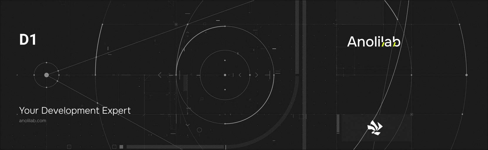

<!-- START_PACKAGE_OG_IMAGE_PLACEHOLDER -->

<a href="https://www.anolilab.com/open-source" align="center">

  

</a>

<h3 align="center">D1 adapter for Lunora .global() tables, wrapping the Sessions API for read-your-writes</h3>

<!-- END_PACKAGE_OG_IMAGE_PLACEHOLDER -->

<br />

<div align="center">

[![typescript-image][typescript-badge]][typescript-url]
[![FSL-1.1-Apache-2.0 licence][license-badge]][license]
[![npm version][npm-version-badge]][npm-version]
[![npm downloads][npm-downloads-badge]][npm-downloads]
[![PRs Welcome][prs-welcome-badge]][prs-welcome]

</div>

---

<div align="center">
    <p>
        <sup>
            Daniel Bannert's open source work is supported by the community on <a href="https://github.com/sponsors/prisis">GitHub Sponsors</a>
        </sup>
    </p>
</div>

---

The D1 adapter for Lunora `.global()` tables. `D1Client` wraps a D1 binding and opens per-request sessions through the D1 Sessions API for read-your-writes consistency across replicas, while `MigrationRunner` applies SQL migrations sequentially. This is what backs cross-shard, globally-replicated tables in a Lunora deployment.

Part of the [Lunora](https://github.com/anolilab/lunora) framework — a type-safe, real-time backend on Cloudflare Workers + Durable Objects with a Vite-first DX.

## Install

```sh
npm install @lunora/d1
```

```sh
yarn add @lunora/d1
```

```sh
pnpm add @lunora/d1
```

## Usage

```ts
import { D1Client } from "@lunora/d1";

// env.DB is the D1 binding configured in wrangler.jsonc.
const client = new D1Client(env.DB);

// Open a Sessions-API session. Pass the bookmark from the previous response
// (forwarded via the `x-d1-bookmark` header) to get read-your-writes across
// replicas; omit it on the first request.
const session = client.withSession(request.headers.get("x-d1-bookmark") ?? undefined);

await session.run("UPDATE users SET name = ? WHERE id = ?", "Ada", userId);
const { results } = await session.all("SELECT * FROM users WHERE id = ?", userId);

// Echo this bookmark back to the client so its next request reads its own write.
const bookmark = session.getBookmark();
```

`session.run` / `all` / `first` take the SQL string followed by positional bind
values (variadic, not an array). `D1Client` also exposes drizzle handles
(`client.drizzle`, `client.drizzleSession(bookmark)`) and a typed `client.batch([...])`
for building queries against generated `sqliteTable` schemas instead of raw SQL.

> This README covers the basics. For the full API, options, and guides, see the **[documentation](https://lunora.sh/docs/api/d1)**.

## Related

- [`@lunora/do`](https://www.npmjs.com/package/@lunora/do) — the per-shard SQLite Durable Objects; `.global()` tables live here in D1 instead.
- [`@lunora/runtime`](https://www.npmjs.com/package/@lunora/runtime) — the query coordinator that fans reads across shards and D1.
- [`@lunora/server`](https://www.npmjs.com/package/@lunora/server) — `defineTable(...).global()` marks a table as D1-backed.

## Supported Node.js Versions

Libraries in this ecosystem make the best effort to track [Node.js' release schedule](https://github.com/nodejs/release#release-schedule).
Here's [a post on why we think this is important](https://medium.com/the-node-js-collection/maintainers-should-consider-following-node-js-release-schedule-ab08ed4de71a).

## Contributing

If you would like to help take a look at the [list of issues](https://github.com/anolilab/lunora/issues) and check our [Contributing](https://github.com/anolilab/lunora/blob/alpha/.github/CONTRIBUTING.md) guidelines.

> **Note:** please note that this project is released with a Contributor Code of Conduct. By participating in this project you agree to abide by its terms.

## Credits

- [Daniel Bannert](https://github.com/prisis)
- [All Contributors](https://github.com/anolilab/lunora/graphs/contributors)

## Made with ❤️ at Anolilab

This is an open source project and will always remain free to use. If you think it's cool, please star it 🌟. [Anolilab](https://www.anolilab.com/open-source) is a Development and AI Studio. Contact us at [hello@anolilab.com](mailto:hello@anolilab.com) if you need any help with these technologies or just want to say hi!

## License

The Lunora d1 package is open-sourced software licensed under the [FSL-1.1-Apache-2.0][license].

<!-- badges -->

[license-badge]: https://img.shields.io/badge/license-FSL--1.1--Apache--2.0-blue.svg?style=for-the-badge
[license]: https://github.com/anolilab/lunora/blob/alpha/LICENSE.md
[npm-version-badge]: https://img.shields.io/npm/v/@lunora/d1?style=for-the-badge
[npm-version]: https://www.npmjs.com/package/@lunora/d1
[npm-downloads-badge]: https://img.shields.io/npm/dm/@lunora/d1?style=for-the-badge
[npm-downloads]: https://www.npmjs.com/package/@lunora/d1
[prs-welcome-badge]: https://img.shields.io/badge/PRs-welcome-brightgreen.svg?style=for-the-badge
[prs-welcome]: https://github.com/anolilab/lunora/blob/alpha/.github/CONTRIBUTING.md
[typescript-badge]: https://img.shields.io/badge/Typescript-294E80.svg?style=for-the-badge&logo=typescript
[typescript-url]: https://www.typescriptlang.org/
