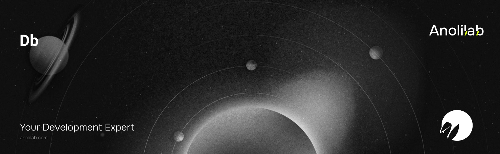

<!-- START_PACKAGE_OG_IMAGE_PLACEHOLDER -->

<a href="https://www.anolilab.com/open-source" align="center">

  

</a>

<h3 align="center">TanStack DB binding: typed, live-synced collections and a durable offline outbox over the Lunora client</h3>

<!-- END_PACKAGE_OG_IMAGE_PLACEHOLDER -->

<br />

<div align="center">

[![typescript-image][typescript-badge]][typescript-url]
[![FSL-1.1-Apache-2.0 licence][license-badge]][license]
[![npm version][npm-version-badge]][npm-version]
[![npm downloads][npm-downloads-badge]][npm-downloads]
[![PRs Welcome][prs-welcome-badge]][prs-welcome]

</div>

---

<div align="center">
    <p>
        <sup>
            Daniel Bannert's open source work is supported by the community on <a href="https://github.com/sponsors/prisis">GitHub Sponsors</a>
        </sup>
    </p>
</div>

---

A [TanStack DB](https://tanstack.com/db) binding for the Lunora client. `defineCollections` wires your Lunora queries and mutations into live, indexed client collections (reads) and a durable, retried offline-transactions outbox (writes) — so a write renders instantly, survives reloads and offline windows, is superseded by the real server row on acknowledgement, and rolls back if the server rejects it. Peer-depends on `@tanstack/db` and `@tanstack/offline-transactions`.

Part of the [Lunora](https://github.com/anolilab/lunora) framework — a type-safe, real-time backend on Cloudflare Workers + Durable Objects with a Vite-first DX.

## Install

```sh
npm install @lunora/db
```

```sh
yarn add @lunora/db
```

```sh
pnpm add @lunora/db
```

## Usage

```ts
import { defineCollections } from "@lunora/db";
import type { LunoraClient } from "@lunora/react";

import { api } from "./_generated/api";
import type { Doc, Id } from "./_generated/dataModel";

export const createCollections = (client: LunoraClient) =>
    defineCollections(client, {
        messages: {
            list: api.messages.list,
            scopeBy: "channelId", // sharded — re-point with db.scope.messages({ channelId })
            insert: {
                mutation: api.messages.send,
                optimistic: (input: Omit<Doc<"messages">, "_id" | "_creationTime">, id) => ({
                    _id: id as Id<"messages">,
                    _creationTime: Date.now(),
                    ...input,
                }),
                toArgs: (row) => ({ channelId: row.channelId, id: row._id, text: row.text }),
            },
        },
        users: { list: api.users.list }, // read-only
    });

// → db.collections.* (feed useLiveQuery), db.actions.* (optimistic writes),
//   db.scope.* (re-point sharded collections), db.executor (the outbox)
```

> `vis generate lunora-collections` scaffolds this from your `schema.ts` + functions.

Keep a **single `db` instance**, and treat its collections as the one source of
truth per table — don't mirror rows into your own store. A derived index (a tree,
a search index, an undo capture) built from a copy of the rows can silently read
stale data while the UI renders through `useLiveQuery`. See [One source of truth
per table](https://lunora.sh/docs/addons/db#one-source-of-truth-per-table).

### Local-first sync engine

Beyond whole-table collections, the `@lunora/db/collections` and
`@lunora/db/mutators` subpaths expose the local-first sync engine:
`lunoraCollectionOptions({ shape })` syncs a **partial replication shape** (only
the rows a client needs, scoped by a server-resolved predicate) over the poke
diff protocol, and `defineMutator` + `bindMutators` run **optimistic custom
mutators** (a local body first, a server-authoritative impl second, rebased on
every sync tick). The framework adapters add a `useMutator` / `createMutator` /
`mutator` hook over a bound handle. See the
**[local-first guide](https://lunora.sh/docs/concepts/local-first)**.

> This README covers the basics. For the full API, options, and guides, see the **[documentation](https://lunora.sh/docs/addons/db)**.

## Related

- [`@lunora/client`](https://www.npmjs.com/package/@lunora/client) — the browser SDK this layer syncs over.
- [`@lunora/react`](https://www.npmjs.com/package/@lunora/react) — React hooks for Lunora queries and mutations.
- [`@lunora/server`](https://www.npmjs.com/package/@lunora/server) — server primitives that define the queries and mutations you bind.

## Supported Node.js Versions

Libraries in this ecosystem make the best effort to track [Node.js' release schedule](https://github.com/nodejs/release#release-schedule).
Here's [a post on why we think this is important](https://medium.com/the-node-js-collection/maintainers-should-consider-following-node-js-release-schedule-ab08ed4de71a).

## Contributing

If you would like to help take a look at the [list of issues](https://github.com/anolilab/lunora/issues) and check our [Contributing](https://github.com/anolilab/lunora/blob/alpha/.github/CONTRIBUTING.md) guidelines.

> **Note:** please note that this project is released with a Contributor Code of Conduct. By participating in this project you agree to abide by its terms.

## Credits

- [Daniel Bannert](https://github.com/prisis)
- [All Contributors](https://github.com/anolilab/lunora/graphs/contributors)

## Made with ❤️ at Anolilab

This is an open source project and will always remain free to use. If you think it's cool, please star it 🌟. [Anolilab](https://www.anolilab.com/open-source) is a Development and AI Studio. Contact us at [hello@anolilab.com](mailto:hello@anolilab.com) if you need any help with these technologies or just want to say hi!

## License

The Lunora db package is open-sourced software licensed under the [FSL-1.1-Apache-2.0][license].

<!-- badges -->

[license-badge]: https://img.shields.io/badge/license-FSL--1.1--Apache--2.0-blue.svg?style=for-the-badge
[license]: https://github.com/anolilab/lunora/blob/alpha/LICENSE.md
[npm-version-badge]: https://img.shields.io/npm/v/@lunora/db?style=for-the-badge
[npm-version]: https://www.npmjs.com/package/@lunora/db
[npm-downloads-badge]: https://img.shields.io/npm/dm/@lunora/db?style=for-the-badge
[npm-downloads]: https://www.npmjs.com/package/@lunora/db
[prs-welcome-badge]: https://img.shields.io/badge/PRs-welcome-brightgreen.svg?style=for-the-badge
[prs-welcome]: https://github.com/anolilab/lunora/blob/alpha/.github/CONTRIBUTING.md
[typescript-badge]: https://img.shields.io/badge/Typescript-294E80.svg?style=for-the-badge&logo=typescript
[typescript-url]: https://www.typescriptlang.org/
