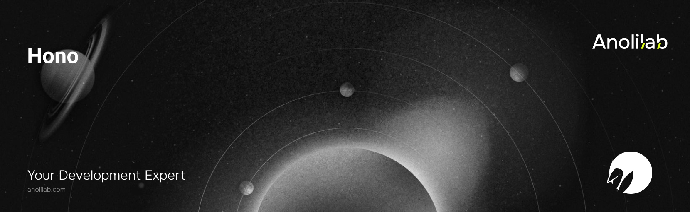

<!-- START_PACKAGE_OG_IMAGE_PLACEHOLDER -->

<a href="https://www.anolilab.com/open-source" align="center">

  

</a>

<h3 align="center">Hono integration for Lunora — single-worker composition (mount Lunora realtime into a Hono app)</h3>

<!-- END_PACKAGE_OG_IMAGE_PLACEHOLDER -->

<br />

<div align="center">

[![typescript-image][typescript-badge]][typescript-url]
[![FSL-1.1-Apache-2.0 licence][license-badge]][license]
[![npm version][npm-version-badge]][npm-version]
[![npm downloads][npm-downloads-badge]][npm-downloads]
[![PRs Welcome][prs-welcome-badge]][prs-welcome]

</div>

---

<div align="center">
    <p>
        <sup>
            Daniel Bannert's open source work is supported by the community on <a href="https://github.com/sponsors/prisis">GitHub Sponsors</a>
        </sup>
    </p>
</div>

---

The Hono integration for Lunora. Hono is a pure HTTP framework with no reactive UI layer, so this package owns only the **server/composition seam**: it lets Lunora's realtime plane (`/_lunora/rpc`, `/_lunora/ws`, `/_lunora/admin/*`) ride _inside_ a Hono app you already own — one Worker, one deploy, same origin. Reactivity on the browser side still comes from `@lunora/client` (or `@lunora/react` / `vue` / `svelte` / `solid`).

Part of the [Lunora](https://github.com/anolilab/lunora) framework — a type-safe, real-time backend on Cloudflare Workers + Durable Objects with a Vite-first DX.

## Install

```sh
npm install @lunora/hono
```

```sh
yarn add @lunora/hono
```

```sh
pnpm add @lunora/hono
```

## Usage

`mountLunora` wraps a `new Hono()` and returns the **same typed app** with Lunora's realtime plane mounted at `/_lunora/*`. It slots straight into your `const app = …` declaration — everything after it is 100% plain Hono:

```ts
import { mountLunora } from "@lunora/hono";
import { Hono } from "hono";

import { defineApp } from "../lunora/_generated/app";

const lunoraApp = defineApp<Env>()
    .shard((env) => env.SHARD)
    .build();

export const ShardDO = lunoraApp.ShardDO;

const app = mountLunora(new Hono<{ Bindings: Env }>());

app.get("/", (c) => c.text("hi"));

export default app;
```

`shardDO` defaults to the conventional `env.SHARD` binding, so the common case needs no options. Pass them to add `auth`, `crons`, or a custom shard namespace:

```ts
mountLunora(app, (env) => ({ shardDO: env.SHARD, auth }));
```

The Durable Object class (`ShardDO`), its `wrangler.jsonc` binding, and codegen are the usual Lunora setup — identical to every other adapter, not specific to Hono.

### Mount it by hand

For a custom path or alongside other middleware, mount the `lunora()` middleware yourself:

```ts
app.use(
    "/_lunora/*",
    lunora((env) => ({ shardDO: env.SHARD })),
);
```

### Lunora owns the entry

The inverse composition — wrap a Hono app as the SSR/REST fallthrough of the shared composer (the same `withFrameworkWorker` behind `@lunora/svelte/worker`, `@lunora/vue/worker`, and `@lunora/astro`):

```ts
import { withLunora } from "@lunora/hono";

export default withLunora(honoApp, (env) => ({ shardDO: env.SHARD }));
```

### Running behind another framework

Lunora's data plane is always Cloudflare Durable Objects. `mountLunora` / `lunora` compose Lunora **in-process**, so they need the Cloudflare runtime (`env.SHARD` + WebSocket upgrade). When your Hono app runs on Node/Vercel (e.g. behind Next.js), point the client at a separately deployed Lunora Worker, or same-origin-proxy the RPC plane with Hono's built-in `proxy`:

```ts
import { proxy } from "hono/proxy";

app.all("/_lunora/rpc", (c) => proxy(`${LUNORA_ORIGIN}${c.req.path}`, c.req.raw));
// WebSockets can't tunnel through serverless — point the client's `wsUrl` at the Worker directly.
```

### Server-side data loading

`@lunora/hono/server` re-exports the framework-neutral reactive-loader helpers (`createServerClient`, `preloadQuery`, `getServerSession`, `serializePreloaded`) for SSR in a Hono handler.

## Related

- [`@lunora/server`](https://github.com/anolilab/lunora/tree/alpha/packages/server) — `defineSchema`, `query`, `mutation`, `action`
- [`@lunora/client`](https://github.com/anolilab/lunora/tree/alpha/packages/client) — the browser SDK
- [`@lunora/astro`](https://github.com/anolilab/lunora/tree/alpha/packages/astro) / [`@lunora/nuxt`](https://github.com/anolilab/lunora/tree/alpha/packages/nuxt) — the other server-composition adapters

## Credits

- [Daniel Bannert](https://github.com/prisis)
- [All Contributors](https://github.com/anolilab/lunora/graphs/contributors)

## Made with ❤️ at Anolilab

This is an open source project and will always remain free to use. If you think it's cool, please star it 🌟. [Anolilab](https://www.anolilab.com/open-source) is a Development and AI Studio. Contact us at [hello@anolilab.com](mailto:hello@anolilab.com) if you need any help with these technologies or just want to say hi!

## License

The Lunora hono package is open-sourced software licensed under the [FSL-1.1-Apache-2.0][license].

<!-- badges -->

[license-badge]: https://img.shields.io/badge/license-FSL--1.1--Apache--2.0-blue.svg?style=for-the-badge
[license]: https://github.com/anolilab/lunora/blob/alpha/LICENSE.md
[npm-version-badge]: https://img.shields.io/npm/v/@lunora/hono?style=for-the-badge
[npm-version]: https://www.npmjs.com/package/@lunora/hono
[npm-downloads-badge]: https://img.shields.io/npm/dm/@lunora/hono?style=for-the-badge
[npm-downloads]: https://www.npmjs.com/package/@lunora/hono
[prs-welcome-badge]: https://img.shields.io/badge/PRs-welcome-brightgreen.svg?style=for-the-badge
[prs-welcome]: https://github.com/anolilab/lunora/blob/alpha/.github/CONTRIBUTING.md
[typescript-badge]: https://img.shields.io/badge/Typescript-294E80.svg?style=for-the-badge&logo=typescript
[typescript-url]: https://www.typescriptlang.org/
