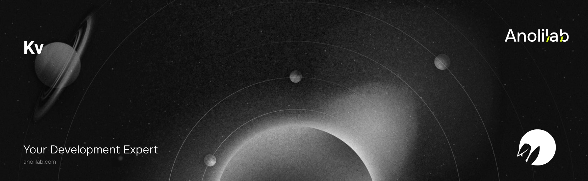

<!-- START_PACKAGE_OG_IMAGE_PLACEHOLDER -->

<a href="https://www.anolilab.com/open-source" align="center">

  

</a>

<h3 align="center">Typed Workers KV for Lunora: JSON helpers and ctx.kv</h3>

<!-- END_PACKAGE_OG_IMAGE_PLACEHOLDER -->

<br />

<div align="center">

[![typescript-image][typescript-badge]][typescript-url]
[![FSL-1.1-Apache-2.0 licence][license-badge]][license]
[![npm version][npm-version-badge]][npm-version]
[![npm downloads][npm-downloads-badge]][npm-downloads]
[![PRs Welcome][prs-welcome-badge]][prs-welcome]

</div>

---

<div align="center">
    <p>
        <sup>
            Daniel Bannert's open source work is supported by the community on <a href="https://github.com/sponsors/prisis">GitHub Sponsors</a>
        </sup>
    </p>
</div>

---

Typed [Cloudflare Workers KV](https://developers.cloudflare.com/kv/) for Lunora. Wraps a `KVNamespace` binding with a small typed API (`get`, `put`, `delete`, `list`, `getWithMetadata`) that JSON-encodes/decodes by default, with a raw escape hatch for text/binary/stream values, TTL + metadata pass-through, and optional per-tenant key scoping.

Part of the [Lunora](https://github.com/anolilab/lunora) framework — a type-safe, real-time backend on Cloudflare Workers + Durable Objects with a Vite-first DX.

## Install

```sh
npm install @lunora/kv
```

```sh
yarn add @lunora/kv
```

```sh
pnpm add @lunora/kv
```

KV namespace bindings are user-defined, so `@lunora/kv` is opt-in: add a `kv_namespaces` entry to your `wrangler.jsonc` and pass `env.<BINDING>` to `createKv`. When a Lunora function imports `@lunora/kv` (or reads `ctx.kv`), codegen wires a typed `ctx.kv` onto `ActionCtx` (KV is a network call, so it is **not** exposed on query/mutation ctx).

## Usage

```ts
import { createKv } from "@lunora/kv";

const kv = createKv({ namespace: env.KV });

// JSON round-trip (default)
await kv.put("flags:beta", { enabled: true }, { expirationTtl: 3600, metadata: { owner: "growth" } });
const flag = await kv.get<{ enabled: boolean }>("flags:beta"); // → { enabled: true } | null

// Raw / typed reads
const raw = await kv.getRaw("blob", { type: "arrayBuffer" });

// Metadata + listing
const { value, metadata } = await kv.getWithMetadata<{ enabled: boolean }, { owner: string }>("flags:beta");
const { keys, cursor, listComplete } = await kv.list({ prefix: "flags:" });
```

### Multi-tenant key scoping

Pass a `keyPrefix` so every operation is namespaced to a tenant, or compose keys explicitly with `scopeKey`:

```ts
import { createKv, scopeKey } from "@lunora/kv";

const tenantKv = createKv({ namespace: env.KV, keyPrefix: `tenant/${tenantId}` });
await tenantKv.put("session", payload); // writes `tenant/<id>/session`

// or, without an instance prefix:
await kv.put(scopeKey(`tenant/${tenantId}`, "session"), payload);
```

### API

- `createKv({ namespace, keyPrefix? })` → `Kv`
- `Kv.get<T>(key, { cacheTtl? })` — JSON-parsed read (`null` when absent)
- `Kv.getRaw<T>(key, { type?, cacheTtl? })` — raw read (`text` | `json` | `arrayBuffer` | `stream`)
- `Kv.getWithMetadata<T, M>(key, { cacheTtl? })` — `{ value, metadata }`
- `Kv.put<T>(key, value, { expirationTtl?, expiration?, metadata?, raw? })`
- `Kv.delete(key)`
- `Kv.list<M>({ prefix?, limit?, cursor? })` — `{ keys, cursor?, listComplete }`
- `scopeKey(prefix, key)` — validated per-tenant key composition

> This README covers the basics. For the full API, options, and guides, see the **[documentation](https://lunora.sh/docs/addons/kv)**.

## Related

- [`@lunora/server`](https://www.npmjs.com/package/@lunora/server) — read `ctx.kv` from actions.
- [`@lunora/storage`](https://www.npmjs.com/package/@lunora/storage) — typed R2 buckets for larger blobs.
- [`@lunora/config`](https://www.npmjs.com/package/@lunora/config) — infers and reconciles the `kv_namespaces` binding.

## Supported Node.js Versions

Libraries in this ecosystem make the best effort to track [Node.js' release schedule](https://github.com/nodejs/release#release-schedule).
Here's [a post on why we think this is important](https://medium.com/the-node-js-collection/maintainers-should-consider-following-node-js-release-schedule-ab08ed4de71a).

## Contributing

If you would like to help take a look at the [list of issues](https://github.com/anolilab/lunora/issues) and check our [Contributing](https://github.com/anolilab/lunora/blob/alpha/.github/CONTRIBUTING.md) guidelines.

> **Note:** please note that this project is released with a Contributor Code of Conduct. By participating in this project you agree to abide by its terms.

## Credits

- [Daniel Bannert](https://github.com/prisis)
- [All Contributors](https://github.com/anolilab/lunora/graphs/contributors)

## Made with ❤️ at Anolilab

This is an open source project and will always remain free to use. If you think it's cool, please star it 🌟. [Anolilab](https://www.anolilab.com/open-source) is a Development and AI Studio. Contact us at [hello@anolilab.com](mailto:hello@anolilab.com) if you need any help with these technologies or just want to say hi!

## License

The Lunora kv package is open-sourced software licensed under the [FSL-1.1-Apache-2.0][license].

<!-- badges -->

[license-badge]: https://img.shields.io/badge/license-FSL--1.1--Apache--2.0-blue.svg?style=for-the-badge
[license]: https://github.com/anolilab/lunora/blob/alpha/LICENSE.md
[npm-version-badge]: https://img.shields.io/npm/v/@lunora/kv?style=for-the-badge
[npm-version]: https://www.npmjs.com/package/@lunora/kv
[npm-downloads-badge]: https://img.shields.io/npm/dm/@lunora/kv?style=for-the-badge
[npm-downloads]: https://www.npmjs.com/package/@lunora/kv
[prs-welcome-badge]: https://img.shields.io/badge/PRs-welcome-brightgreen.svg?style=for-the-badge
[prs-welcome]: https://github.com/anolilab/lunora/blob/alpha/.github/CONTRIBUTING.md
[typescript-badge]: https://img.shields.io/badge/Typescript-294E80.svg?style=for-the-badge&logo=typescript
[typescript-url]: https://www.typescriptlang.org/
