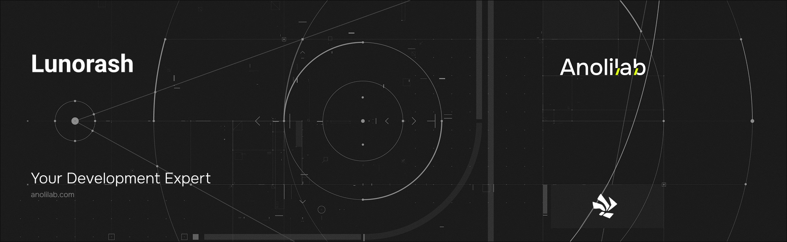

<!-- START_PACKAGE_OG_IMAGE_PLACEHOLDER -->

<a href="https://www.anolilab.com/open-source" align="center">

  

</a>

<h3 align="center">The Lunora umbrella package: one install for the server authoring API, worker runtime, Durable Objects, and the lunora CLI</h3>

<!-- END_PACKAGE_OG_IMAGE_PLACEHOLDER -->

<br />

<div align="center">

[![typescript-image][typescript-badge]][typescript-url]
[![FSL-1.1-Apache-2.0 licence][license-badge]][license]
[![npm version][npm-version-badge]][npm-version]
[![npm downloads][npm-downloads-badge]][npm-downloads]
[![PRs Welcome][prs-welcome-badge]][prs-welcome]

</div>

---

<div align="center">
    <p>
        <sup>
            Daniel Bannert's open source work is supported by the community on <a href="https://github.com/sponsors/prisis">GitHub Sponsors</a>
        </sup>
    </p>
</div>

---

The Lunora umbrella package: one install for the base of a Lunora app. `lunora` re-exports the server authoring API, the worker runtime, the Durable Objects, and the browser client through subpaths, and ships the `lunora` CLI binary — so you depend on a single package instead of `@lunora/server` + `@lunora/values` + `@lunora/runtime` + `@lunora/do` + `@lunora/client` + `@lunora/cli`.

Part of the [Lunora](https://github.com/anolilab/lunora) framework — a type-safe, real-time backend on Cloudflare Workers + Durable Objects with a Vite-first DX.

## Install

```sh
npm install lunorash
```

```sh
yarn add lunorash
```

```sh
pnpm add lunorash
```

Pick a framework adapter (`@lunora/react`, `@lunora/vue`, `@lunora/solid`, `@lunora/svelte`, `@lunora/astro`), the Vite plugin (`@lunora/vite`), and any add-ons (`@lunora/auth`, `@lunora/mail`, `@lunora/storage`, …) alongside it — those stay as separate, opt-in installs.

## Usage

```ts
// lunora/schema.ts — the authoring API
import { defineSchema, defineTable } from "lunorash/server";
import { v } from "lunorash/values";

export default defineSchema({
    messages: defineTable({ body: v.string(), author: v.id("users") }),
});
```

```ts
// src/worker.ts — the worker entry
import { createWorker } from "lunorash/runtime";

export { ShardDO } from "lunorash/do";

export default createWorker({ shardDO: (env) => env.SHARD });
```

The `lunora` binary delegates to `@lunora/cli`, so the full CLI is available without a separate dependency:

```sh
pnpm exec lunora dev
pnpm exec lunora codegen
pnpm exec lunora deploy
```

### Subpaths

| Import                         | Re-exports         | Use                                                |
| ------------------------------ | ------------------ | -------------------------------------------------- |
| `lunorash` / `lunorash/server` | `@lunora/server`   | `query` / `mutation` / `action`, `defineSchema`, … |
| `lunorash/values`              | `@lunora/values`   | the `v.*` validator suite                          |
| `lunorash/runtime`             | `@lunora/runtime`  | `createWorker` and the query coordinator           |
| `lunorash/do`                  | `@lunora/do`       | `ShardDO` / `SessionDO`                            |
| `lunorash/platform`            | `@lunora/platform` | Host contracts (`ShardHost`, `SocketHost`, …)      |
| `lunorash/client`              | `@lunora/client`   | the browser SDK (`LunoraClient`, `Preloaded`, …)   |

Granular subpaths are forwarded too: `lunorash/server/types`, `lunorash/server/data-model`, `lunorash/server/drizzle`, and `lunorash/server/rls/testing` mirror `@lunora/server/*`; `lunorash/client/query`, `lunorash/client/auth`, `lunorash/client/pagination`, and `lunorash/client/ssr` mirror `@lunora/client/*`.

Codegen targets these subpaths automatically: a project with `lunorash` installed gets `_generated/*` files that import from `lunorash/server`, `lunorash/server/data-model`, `lunorash/do`, `lunorash/client`, etc.

> This README covers the basics. For the full API, options, and guides, see the **[documentation](https://lunora.sh/docs)**.

## Related

- [`@lunora/server`](https://www.npmjs.com/package/@lunora/server) — the authoring API re-exported at `lunorash/server`.
- [`@lunora/cli`](https://www.npmjs.com/package/@lunora/cli) — the CLI the `lunora` binary delegates to.
- [`@lunora/vite`](https://www.npmjs.com/package/@lunora/vite) — the Vite plugin (installed separately).

## Supported Node.js Versions

Libraries in this ecosystem make the best effort to track [Node.js' release schedule](https://github.com/nodejs/release#release-schedule).
Here's [a post on why we think this is important](https://medium.com/the-node-js-collection/maintainers-should-consider-following-node-js-release-schedule-ab08ed4de71a).

## Contributing

If you would like to help take a look at the [list of issues](https://github.com/anolilab/lunora/issues) and check our [Contributing](https://github.com/anolilab/lunora/blob/alpha/.github/CONTRIBUTING.md) guidelines.

> **Note:** please note that this project is released with a Contributor Code of Conduct. By participating in this project you agree to abide by its terms.

## Credits

- [Daniel Bannert](https://github.com/prisis)
- [All Contributors](https://github.com/anolilab/lunora/graphs/contributors)

## Made with ❤️ at Anolilab

This is an open source project and will always remain free to use. If you think it's cool, please star it 🌟. [Anolilab](https://www.anolilab.com/open-source) is a Development and AI Studio. Contact us at [hello@anolilab.com](mailto:hello@anolilab.com) if you need any help with these technologies or just want to say hi!

## License

The Lunora umbrella package is open-sourced software licensed under the [FSL-1.1-Apache-2.0][license].

<!-- badges -->

[license-badge]: https://img.shields.io/badge/license-FSL--1.1--Apache--2.0-blue.svg?style=for-the-badge
[license]: https://github.com/anolilab/lunora/blob/alpha/LICENSE.md
[npm-version-badge]: https://img.shields.io/npm/v/lunora?style=for-the-badge
[npm-version]: https://www.npmjs.com/package/lunora
[npm-downloads-badge]: https://img.shields.io/npm/dm/lunora?style=for-the-badge
[npm-downloads]: https://www.npmjs.com/package/lunora
[prs-welcome-badge]: https://img.shields.io/badge/PRs-welcome-brightgreen.svg?style=for-the-badge
[prs-welcome]: https://github.com/anolilab/lunora/blob/alpha/.github/CONTRIBUTING.md
[typescript-badge]: https://img.shields.io/badge/Typescript-294E80.svg?style=for-the-badge&logo=typescript
[typescript-url]: https://www.typescriptlang.org/
