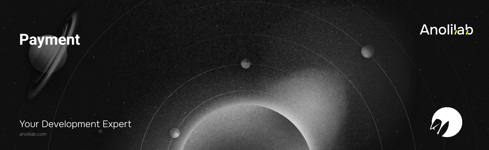

<!-- START_PACKAGE_OG_IMAGE_PLACEHOLDER -->

<a href="https://www.anolilab.com/open-source" align="center">

  

</a>

<h3 align="center">Provider-agnostic payments for Lunora: Stripe-first adapter, webhook sync, and subscription/payment state machine</h3>

<!-- END_PACKAGE_OG_IMAGE_PLACEHOLDER -->

> **Experimental** — this package is outside the Lunora 1.0 stability promise: its API may change in any release, without a major version bump.

<br />

<div align="center">

[![typescript-image][typescript-badge]][typescript-url]
[![FSL-1.1-Apache-2.0 licence][license-badge]][license]
[![npm version][npm-version-badge]][npm-version]
[![npm downloads][npm-downloads-badge]][npm-downloads]
[![PRs Welcome][prs-welcome-badge]][prs-welcome]

</div>

---

<div align="center">
    <p>
        <sup>
            Daniel Bannert's open source work is supported by the community on <a href="https://github.com/sponsors/prisis">GitHub Sponsors</a>
        </sup>
    </p>
</div>

---

One provider-agnostic payments API over Stripe and Polar. Webhook events are verified, normalized, and applied through an explicit payment/subscription state machine that makes duplicate and out-of-order deliveries safe by construction, then synced into a durable store. Outbound calls carry idempotency keys (no double-charge), and every mutation is authorized per-caller.

The provider is a stateless translator; the store owns all state. Switching providers is a configuration change, not a rewrite.

Part of the [Lunora](https://github.com/anolilab/lunora) framework — a type-safe, real-time backend on Cloudflare Workers + Durable Objects with a Vite-first DX.

## Install

```sh
pnpm add @lunora/payment stripe
```

`stripe` is an optional peer dependency — install only the provider SDK you use; the adapter takes the client by injection. The same holds for the other providers: `createPolarAdapter` (Polar), `createAutumnAdapter` ([Autumn](https://useautumn.com)), `createDodoPaymentsAdapter` ([Dodo Payments](https://dodopayments.com)), and `createCreemAdapter` ([Creem](https://creem.io)) take a structural client too, so no provider SDK is a hard dependency of this package. Additional providers plug in via `PaymentAdapter`.

## Usage

Build a facade from an adapter and a store, then start a hosted checkout:

```ts
import { createPayment, MemoryPaymentStore } from "@lunora/payment";
import { createStripeAdapter } from "@lunora/payment/stripe";
import Stripe from "stripe";

const payment = createPayment({
    adapter: createStripeAdapter({
        client: new Stripe(env.STRIPE_SECRET_KEY),
        webhookSecret: env.STRIPE_WEBHOOK_SECRET,
    }),
    store: new MemoryPaymentStore(),
});

const { url } = await payment.createCheckout({
    referenceId: "user_123",
    priceId: "price_123",
    mode: "subscription",
    successUrl: "https://app.test/done",
    cancelUrl: "https://app.test/cancel",
});
```

In a Lunora app you don't build the facade by hand: codegen wires `ctx.payments` onto `ActionCtx` whenever a `lunora/` source imports `@lunora/payment` or reads `ctx.payments`. You supply the adapter via the `payment(env)` thunk passed to `createShardDO()`; the store is built per request from `ctx.db`, and the default authorizer ties `referenceId` to `ctx.auth.userId`.

```ts
import { action, v } from "./_generated/server";

export const checkout = action.input({ priceId: v.string() }).action(async ({ ctx, args: { priceId } }): Promise<{ url: string }> => {
    const { url } = await ctx.payments.createCheckout({
        referenceId: ctx.auth.userId,
        priceId,
        mode: "subscription",
        successUrl: "https://app.test/done",
        cancelUrl: "https://app.test/cancel",
    });

    return { url };
});
```

Webhook signature verification needs the raw request body, so the endpoint runs at the Worker edge via `httpAction` and forwards the raw body into an `internalAction` where `ctx.payments` (and its store) exists:

```ts
// lunora/http.ts
import { webhookResponse } from "@lunora/payment";
import { httpAction, httpRouter } from "lunorash/server";
import { processWebhook } from "./billing";

export const app = httpRouter();

app.post(
    "/payment/webhook",
    httpAction(async (ctx, request) => {
        const body = await request.text();
        const signature = request.headers.get("stripe-signature") ?? "";

        return webhookResponse(await ctx.runAction(processWebhook, { body, signature }));
    }),
);
```

Once the signature verifies, `handleWebhook` acknowledges with `200` — a duplicate or no-op event is not re-applied — with one deliberate exception: an **orphaned** event, one patching a row whose create event has not arrived yet, answers `500` so the provider retries it (bounded to a single retry). That is why the route must use `webhookResponse`: `Response.json(result)` would answer `200` for every outcome, and an out-of-order delivery would be lost for good.

> This README covers the basics. For the full API — entitlements, usage metering, reconciliation, and the stored tables — see the [documentation](https://lunora.sh/docs/packages/payment).

## Related

- [`@lunora/server`](https://www.npmjs.com/package/@lunora/server) — call payments from actions; mirror tables into your schema.
- [`@lunora/scheduler`](https://www.npmjs.com/package/@lunora/scheduler) — webhook side-effects and the reconciliation sweep.
- [`@lunora/auth`](https://www.npmjs.com/package/@lunora/auth) — resolve the caller identity behind `referenceId`.

## Supported Node.js Versions

Libraries in this ecosystem make the best effort to track [Node.js' release schedule](https://github.com/nodejs/release#release-schedule).
Here's [a post on why we think this is important](https://medium.com/the-node-js-collection/maintainers-should-consider-following-node-js-release-schedule-ab08ed4de71a).

## Contributing

If you would like to help take a look at the [list of issues](https://github.com/anolilab/lunora/issues) and check our [Contributing](https://github.com/anolilab/lunora/blob/alpha/.github/CONTRIBUTING.md) guidelines.

> **Note:** please note that this project is released with a Contributor Code of Conduct. By participating in this project you agree to abide by its terms.

## Credits

- [Daniel Bannert](https://github.com/prisis)
- [All Contributors](https://github.com/anolilab/lunora/graphs/contributors)

## Made with ❤️ at Anolilab

This is an open source project and will always remain free to use. If you think it's cool, please star it 🌟. [Anolilab](https://www.anolilab.com/open-source) is a Development and AI Studio. Contact us at [hello@anolilab.com](mailto:hello@anolilab.com) if you need any help with these technologies or just want to say hi!

## License

The Lunora payment package is open-sourced software licensed under the [FSL-1.1-Apache-2.0][license].

<!-- badges -->

[license-badge]: https://img.shields.io/badge/license-FSL--1.1--Apache--2.0-blue.svg?style=for-the-badge
[license]: https://github.com/anolilab/lunora/blob/alpha/LICENSE.md
[npm-version-badge]: https://img.shields.io/npm/v/@lunora/payment?style=for-the-badge
[npm-version]: https://www.npmjs.com/package/@lunora/payment
[npm-downloads-badge]: https://img.shields.io/npm/dm/@lunora/payment?style=for-the-badge
[npm-downloads]: https://www.npmjs.com/package/@lunora/payment
[prs-welcome-badge]: https://img.shields.io/badge/PRs-welcome-brightgreen.svg?style=for-the-badge
[prs-welcome]: https://github.com/anolilab/lunora/blob/alpha/.github/CONTRIBUTING.md
[typescript-badge]: https://img.shields.io/badge/Typescript-294E80.svg?style=for-the-badge&logo=typescript
[typescript-url]: https://www.typescriptlang.org/
