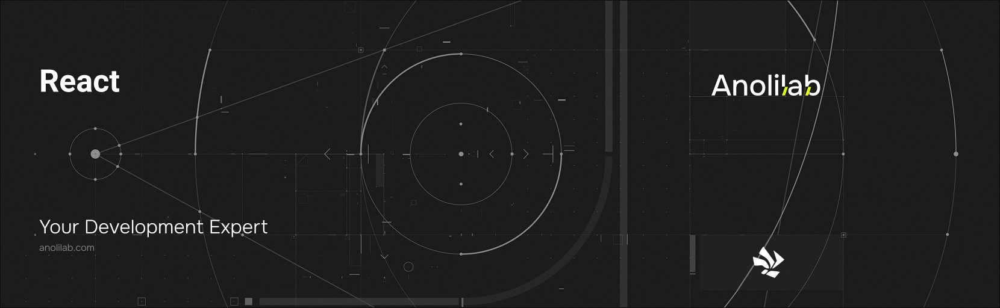

<!-- START_PACKAGE_OG_IMAGE_PLACEHOLDER -->

<a href="https://www.anolilab.com/open-source" align="center">

  

</a>

<h3 align="center">React hooks for Lunora: useQuery, useMutation, useSubscription, and useAuth</h3>

<!-- END_PACKAGE_OG_IMAGE_PLACEHOLDER -->

<br />

<div align="center">

[![typescript-image][typescript-badge]][typescript-url]
[![FSL-1.1-Apache-2.0 licence][license-badge]][license]
[![npm version][npm-version-badge]][npm-version]
[![npm downloads][npm-downloads-badge]][npm-downloads]
[![PRs Welcome][prs-welcome-badge]][prs-welcome]

</div>

---

<div align="center">
    <p>
        <sup>
            Daniel Bannert's open source work is supported by the community on <a href="https://github.com/sponsors/prisis">GitHub Sponsors</a>
        </sup>
    </p>
</div>

---

React hooks for Lunora — `useQuery`, `useMutation`, `useSubscription`, `useAuth`, and more — that wrap a `@lunora/client` instance behind a `LunoraProvider`. The hooks are client-only; server-side data loading lives in the socket-free `@lunora/react/server` entry.

Part of the [Lunora](https://github.com/anolilab/lunora) framework — a type-safe, real-time backend on Cloudflare Workers + Durable Objects with a Vite-first DX.

## Install

```sh
npm install @lunora/react
```

```sh
yarn add @lunora/react
```

```sh
pnpm add @lunora/react
```

## Usage

```tsx
import { LunoraClient } from "@lunora/client";
import { LunoraProvider, useMutation, useQuery } from "@lunora/react";
import { api } from "./lunora/_generated/api";

const client = new LunoraClient({ url: "https://app.acme.test" });

export function App() {
    return (
        <LunoraProvider client={client}>
            <MessageList room="general" />
        </LunoraProvider>
    );
}

function MessageList({ room }: { room: string }) {
    const messages = useQuery(api.messages.list, { room });
    const { mutate, pending } = useMutation(api.messages.send);

    if (messages === undefined) return <p>Loading…</p>;

    return (
        <>
            <ul>
                {messages.map((m) => (
                    <li key={m.id}>{m.body}</li>
                ))}
            </ul>
            <button disabled={pending} onClick={() => mutate({ room, body: "hi" })}>
                Send
            </button>
        </>
    );
}
```

`useQuery` returns `undefined` until the first response lands; pass `"skip"` as the args to short-circuit (no network call, no subscription). `useMutation(fn)` returns `{ mutate, pending, data, error, reset, withOptimisticUpdate }` — `mutate` is awaitable and rejects on failure.

## Hooks

| Hook                                                 | Returns                                                         | Notes                                                                          |
| ---------------------------------------------------- | --------------------------------------------------------------- | ------------------------------------------------------------------------------ |
| `useQuery(fn, args, options?)`                       | `T \| undefined`                                                | Live query; shares one WS subscription across consumers of the same key.       |
| `useMutation(fn)`                                    | `{ mutate, pending, data, error, reset, withOptimisticUpdate }` | Per-call `optimistic` / `optimisticUpdate` options pass through to the client. |
| `useSubscription(fn, args, options?)`                | `{ data, error }`                                               | No initial fetch — only server-pushed values.                                  |
| `usePaginatedQuery(fn, args, { initialNumItems })`   | `{ results, status, isLoading, loadMore }`                      | Cursor-paginated feed that stays consistent under live edits.                  |
| `useInfiniteQuery(fn, args, { initialNumItems })`    | `{ pages, status, hasNextPage, fetchNextPage, … }`              | Page-array variant of the same paginator.                                      |
| `usePreloadedQuery(preloaded)`                       | `T`                                                             | Reads a server `Preloaded` token, then goes live.                              |
| `usePresence({ heartbeat, listPresent, roomId, … })` | present members                                                 | Drives the `definePresence` heartbeat + list functions.                        |
| `useStream(fn, args, options?)`                      | `{ chunks, status, error, cancel }`                             | Consumes a streamed action response chunk by chunk.                            |
| `useRateLimit(config, options?)`                     | `{ ok, disabled, retryAfter, check, consume, reset }`           | Client-side mirror of a `@lunora/ratelimit` budget for instant UX.             |
| `useConnectionStatus()`                              | `ConnectionStatus`                                              | `idle` / `connecting` / `connected` / `offline`.                               |
| `useAuth()`                                          | `{ user, token, setToken }`                                     | Call `setToken(jwt)` after sign-in; RPC then carries the token.                |
| `useAuthState()`                                     | `{ isAuthenticated, isLoading }`                                | Hydration-safe three-state gate.                                               |

`Authenticated`, `Unauthenticated`, and `AuthLoading` are gate components built on `useAuthState`. `CheckoutButton`, `CustomerPortalButton`, and `useCheckout` wrap `@lunora/payment` flows.

## Server Components

The package root is a client boundary. For React Server Components / the Next.js App Router, load data from the socket-free `@lunora/react/server` entry: `prefetchQuery` seeds the TanStack cache for `HydrationBoundary`, `preloadQuery` returns a serializable token for `usePreloadedQuery`, and `fetchQuery` / `fetchMutation` / `fetchAction` run one-shot RPC calls. Build a fresh `createServerClient({ url, token? })` per request so a user's token never leaks across requests.

> This README covers the basics. For the full API, options, and guides, see the **[documentation](https://lunora.sh/docs/api/react)**.

## Related

- [`@lunora/client`](https://www.npmjs.com/package/@lunora/client) — the browser SDK these hooks wrap. Its `@lunora/client/query` subpath is the shared live-query state machine, and `@lunora/client/ssr` provides the server-side preloading used by `@lunora/react/server`.

## Supported Node.js Versions

Libraries in this ecosystem make the best effort to track [Node.js' release schedule](https://github.com/nodejs/release#release-schedule).
Here's [a post on why we think this is important](https://medium.com/the-node-js-collection/maintainers-should-consider-following-node-js-release-schedule-ab08ed4de71a).

## Contributing

If you would like to help take a look at the [list of issues](https://github.com/anolilab/lunora/issues) and check our [Contributing](https://github.com/anolilab/lunora/blob/alpha/.github/CONTRIBUTING.md) guidelines.

> **Note:** please note that this project is released with a Contributor Code of Conduct. By participating in this project you agree to abide by its terms.

## Credits

- [Daniel Bannert](https://github.com/prisis)
- [All Contributors](https://github.com/anolilab/lunora/graphs/contributors)

## Made with ❤️ at Anolilab

This is an open source project and will always remain free to use. If you think it's cool, please star it 🌟. [Anolilab](https://www.anolilab.com/open-source) is a Development and AI Studio. Contact us at [hello@anolilab.com](mailto:hello@anolilab.com) if you need any help with these technologies or just want to say hi!

## License

The Lunora react package is open-sourced software licensed under the [FSL-1.1-Apache-2.0][license].

<!-- badges -->

[license-badge]: https://img.shields.io/badge/license-FSL--1.1--Apache--2.0-blue.svg?style=for-the-badge
[license]: https://github.com/anolilab/lunora/blob/alpha/LICENSE.md
[npm-version-badge]: https://img.shields.io/npm/v/@lunora/react?style=for-the-badge
[npm-version]: https://www.npmjs.com/package/@lunora/react
[npm-downloads-badge]: https://img.shields.io/npm/dm/@lunora/react?style=for-the-badge
[npm-downloads]: https://www.npmjs.com/package/@lunora/react
[prs-welcome-badge]: https://img.shields.io/badge/PRs-welcome-brightgreen.svg?style=for-the-badge
[prs-welcome]: https://github.com/anolilab/lunora/blob/alpha/.github/CONTRIBUTING.md
[typescript-badge]: https://img.shields.io/badge/Typescript-294E80.svg?style=for-the-badge&logo=typescript
[typescript-url]: https://www.typescriptlang.org/
