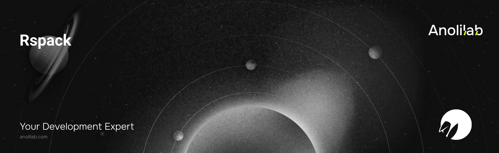

<!-- START_PACKAGE_OG_IMAGE_PLACEHOLDER -->

<a href="https://www.anolilab.com/open-source" align="center">

  

</a>

<h3 align="center">The Lunora Rspack plugin: codegen, binding provisioning, and wrangler validation for Rspack projects</h3>

<!-- END_PACKAGE_OG_IMAGE_PLACEHOLDER -->

<br />

<div align="center">

[![typescript-image][typescript-badge]][typescript-url]
[![FSL-1.1-Apache-2.0 licence][license-badge]][license]
[![npm version][npm-version-badge]][npm-version]
[![npm downloads][npm-downloads-badge]][npm-downloads]
[![PRs Welcome][prs-welcome-badge]][prs-welcome]

</div>

---

<div align="center">
    <p>
        <sup>
            Daniel Bannert's open source work is supported by the community on <a href="https://github.com/sponsors/prisis">GitHub Sponsors</a>
        </sup>
    </p>
</div>

---

The Lunora [Rspack](https://rspack.rs) plugin. It runs `@lunora/codegen` before every compilation, writes the Cloudflare bindings your code implies into `wrangler.jsonc`, and validates that config against your schema — the build-time half of what [`@lunora/vite`](https://www.npmjs.com/package/@lunora/vite) does.

Part of the [Lunora](https://github.com/anolilab/lunora) framework — a type-safe, real-time backend on Cloudflare Workers + Durable Objects.

## Install

```sh
npm install @lunora/rspack
```

```sh
yarn add @lunora/rspack
```

```sh
pnpm add @lunora/rspack
```

## Usage

```js
// rspack.config.mjs
import { lunoraRspack } from "@lunora/rspack";

export default {
    plugins: [lunoraRspack()],
};
```

Under [Rsbuild](https://rsbuild.rs), add it to `tools.rspack`:

```ts
// rsbuild.config.ts
import { lunoraRspack } from "@lunora/rspack";
import { defineConfig } from "@rsbuild/core";

export default defineConfig({
    tools: {
        rspack: { plugins: [lunoraRspack()] },
    },
});
```

The plugin API it taps is webpack 5's, so the same instance works in a plain webpack build unchanged.

## It does not run your Worker

Rspack has no `@cloudflare/vite-plugin` equivalent — nothing that boots workerd/miniflare inside the compiler. So this plugin builds the client half and **`wrangler dev` (or `lunora dev`) runs the Worker**, which is the same split as `@lunora/vite`'s `cloudflare: false` path.

Everything in the Vite plugin that lives on the dev server therefore has no counterpart here:

| Feature                                   | Here            | Where to get it                 |
| ----------------------------------------- | --------------- | ------------------------------- |
| Codegen on save, wrangler validation      | ✅              | —                               |
| Binding / cron / compatibility-date sync  | ✅              | —                               |
| `.dev.vars` scaffolding, agent-rules hint | ✅ (watch mode) | —                               |
| Worker dev runtime (workerd)              | ❌              | `lunora dev` or `wrangler dev`  |
| Browser error overlay                     | ❌              | `@lunora/vite`                  |
| Embedded Studio at `/__lunora`            | ❌              | `lunora dev`, or `@lunora/vite` |
| Worker log streaming, container logs      | ❌              | `lunora dev`                    |
| Remote-binding dev (`LUNORA_REMOTE`)      | ❌              | `lunora dev`                    |
| Class-A framework worker composition      | ❌              | `@lunora/vite`                  |

Reach for `@lunora/vite` if you want those in-process.

## What each pass does

Before every compilation, in this order:

1. **Provision bindings** — infers the Durable Objects, their migration classes, and the `DB` D1 binding a `.global()` table implies, and writes them into `wrangler.jsonc`. Idempotent.
2. **Validate** — checks that config against the schema's requirements, and throws when it is short one (`validateWrangler: false` opts out).
3. **Generate** — runs `@lunora/codegen` into `<schemaDir>/_generated`, syncing your cron triggers and the compatibility date on the way.
4. **`postcodegen`** — runs the project's hook.

In watch mode the plugin registers your schema directory as a watch dependency, so editing _or adding_ anything under `lunora/` regenerates. The first pass of a session also scaffolds `.dev.vars` (it is gitignored, so a fresh clone has none and the Worker throws on its first required secret).

A production build **fails** on an ERROR-level schema advisory or platform diagnostic, exactly as `vite build` and `lunora deploy` do. A watch rebuild logs them and carries on — a half-typed schema should not take the watcher down.

## Options

```ts
lunoraRspack({
    projectRoot: process.cwd(), // directory containing `lunora/`
    schemaDir: "lunora", // where `schema.ts` and your function files live
    apiSpec: "openapi", // "openapi" | "openrpc" | "both" | "none"
    target: "cloudflare", // defaults to `target` in lunora.config.*
    validateWrangler: true, // set false to skip the wrangler.jsonc check
});
```

`LUNORA_CODEGEN=0` disables the plugin entirely — no generation, no wrangler checks, no watch registration.

> This README covers the basics. For the full API, options, and guides, see the **[documentation](https://lunora.sh/docs/packages/rspack)**.

## Related

- [`@lunora/vite`](https://www.npmjs.com/package/@lunora/vite) — the Vite plugin, including the Worker dev runtime.
- [`@lunora/cli`](https://www.npmjs.com/package/@lunora/cli) — the CLI; `lunora dev` runs the Worker alongside your Rspack build.
- [`@lunora/codegen`](https://www.npmjs.com/package/@lunora/codegen) — the code generator run on schema changes.
- [`@lunora/config`](https://www.npmjs.com/package/@lunora/config) — shared `wrangler.jsonc` validation and binding inference.

## Supported Node.js Versions

Libraries in this ecosystem make the best effort to track [Node.js' release schedule](https://github.com/nodejs/release#release-schedule).
Here's [a post on why we think this is important](https://medium.com/the-node-js-collection/maintainers-should-consider-following-node-js-release-schedule-ab08ed4de71a).

## Contributing

If you would like to help take a look at the [list of issues](https://github.com/anolilab/lunora/issues) and check our [Contributing](https://github.com/anolilab/lunora/blob/alpha/.github/CONTRIBUTING.md) guidelines.

> **Note:** please note that this project is released with a Contributor Code of Conduct. By participating in this project you agree to abide by its terms.

## Credits

- [Daniel Bannert](https://github.com/prisis)
- [All Contributors](https://github.com/anolilab/lunora/graphs/contributors)

## Made with ❤️ at Anolilab

This is an open source project and will always remain free to use. If you think it's cool, please star it 🌟. [Anolilab](https://www.anolilab.com/open-source) is a Development and AI Studio. Contact us at [hello@anolilab.com](mailto:hello@anolilab.com) if you need any help with these technologies or just want to say hi!

## License

The Lunora rspack package is open-sourced software licensed under the [FSL-1.1-Apache-2.0][license].

<!-- badges -->

[license-badge]: https://img.shields.io/badge/license-FSL--1.1--Apache--2.0-blue.svg?style=for-the-badge
[license]: https://github.com/anolilab/lunora/blob/alpha/LICENSE.md
[npm-version-badge]: https://img.shields.io/npm/v/@lunora/rspack?style=for-the-badge
[npm-version]: https://www.npmjs.com/package/@lunora/rspack
[npm-downloads-badge]: https://img.shields.io/npm/dm/@lunora/rspack?style=for-the-badge
[npm-downloads]: https://www.npmjs.com/package/@lunora/rspack
[prs-welcome-badge]: https://img.shields.io/badge/PRs-welcome-brightgreen.svg?style=for-the-badge
[prs-welcome]: https://github.com/anolilab/lunora/blob/alpha/.github/CONTRIBUTING.md
[typescript-badge]: https://img.shields.io/badge/Typescript-294E80.svg?style=for-the-badge&logo=typescript
[typescript-url]: https://www.typescriptlang.org/
