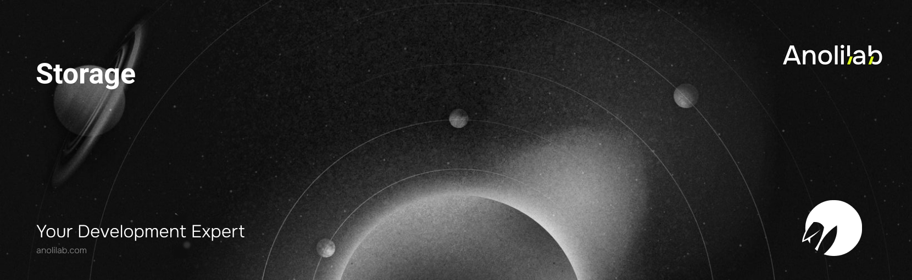

<!-- START_PACKAGE_OG_IMAGE_PLACEHOLDER -->

<a href="https://www.anolilab.com/open-source" align="center">

  

</a>

<h3 align="center">R2-backed storage for Lunora: typed buckets and signed URLs</h3>

<!-- END_PACKAGE_OG_IMAGE_PLACEHOLDER -->

<br />

<div align="center">

[![typescript-image][typescript-badge]][typescript-url]
[![FSL-1.1-Apache-2.0 licence][license-badge]][license]
[![npm version][npm-version-badge]][npm-version]
[![npm downloads][npm-downloads-badge]][npm-downloads]
[![PRs Welcome][prs-welcome-badge]][prs-welcome]

</div>

---

<div align="center">
    <p>
        <sup>
            Daniel Bannert's open source work is supported by the community on <a href="https://github.com/sponsors/prisis">GitHub Sponsors</a>
        </sup>
    </p>
</div>

---

R2-backed file storage for Lunora. Wraps a Cloudflare `R2Bucket` binding with a typed API (`upload`/`store`, `download`, `head`, `delete`, `list`, `getMetadata`, multipart), worker-signed URLs for app-gated access, and native S3 presigned URLs for direct-to-R2 transfer.

Part of the [Lunora](https://github.com/anolilab/lunora) framework — a type-safe, real-time backend on Cloudflare Workers + Durable Objects with a Vite-first DX.

## Install

```sh
npm install @lunora/storage
```

```sh
yarn add @lunora/storage
```

```sh
pnpm add @lunora/storage
```

## Usage

Declare the bucket on your app and read it off `ctx.storage` in a handler. The app builder wires `createStorage` for you, so you rarely call it directly:

```ts
// lunora/app.ts — defineApp is emitted by codegen into _generated/app
import { defineApp } from "@/lunora/_generated/app";

export default defineApp<Env>()
    .shard((env) => env.SHARD)
    .storage({
        bucket: (env) => env.FILES,
        publicBaseUrl: (env) => env.PUBLIC_STORAGE_BASE_URL,
        signingSecret: (env) => env.STORAGE_SECRET,
    })
    .build();
```

```ts
// lunora/avatars.ts
import { action, v } from "@/lunora/_generated/server";

// Minting an upload URL is a write capability, so this is an `action`.
// Queries and mutations are TYPED with a read-only `ctx.storage`; the full
// surface (generateUploadUrl/store/delete/getPresignedUrl) is action-only.
// Multipart and `list` are on a `createStorage` instance, not on any ctx.
export const uploadAvatar = action.input({ contentType: v.string() }).action(async ({ args, ctx }) => {
    const key = `avatars/${ctx.auth.userId ?? "anonymous"}/profile`;

    // Short-lived signed PUT URL — the client uploads to your Worker route,
    // which verifies the signature and writes to R2, with the Content-Type
    // pinned into that signature.
    const url = await ctx.storage.generateUploadUrl(key, { contentType: args.contentType, expiresInSeconds: 60 });

    return { key, url };
});
```

`ctx.storage` is a `Storage` instance. Outside a handler (a script, a custom Worker route) build one directly:

```ts
import { createStorage } from "@lunora/storage";

const storage = createStorage({
    bucket: env.FILES,
    // Required. The name this bucket is registered under, bound into every signed
    // URL's HMAC (and mirrored as `&bucket=`), so a URL minted for one bucket
    // cannot be replayed against another sharing the signing secret. `"default"`
    // for a single-bucket app; the registered name for anything reached through
    // `createBucketStorage`.
    bucketName: "default",
    publicBaseUrl: "https://cdn.acme.test",
    signingSecret: env.STORAGE_SECRET,
});

await storage.upload("uploads/avatar.png", bytes, { contentType: "image/png", maxSize: 5_000_000 });

const url = await storage.getSignedUrl("uploads/avatar.png", { expiresInSeconds: 600 });
```

> This README covers the basics. For the full API, options, and guides, see the **[documentation](https://lunora.sh/docs/packages/storage)**.

## Related

- [`@lunora/server`](https://www.npmjs.com/package/@lunora/server) — call storage from queries, mutations, and actions.
- [`@lunora/runtime`](https://www.npmjs.com/package/@lunora/runtime) — the Worker runtime your signed-URL route sits in front of. It ships no public storage route of its own: the route that verifies a signed URL and moves the bytes is yours to add (see the `storage` registry item).
- [`@lunora/d1`](https://www.npmjs.com/package/@lunora/d1) — store object metadata alongside your data.

## Supported Node.js Versions

Libraries in this ecosystem make the best effort to track [Node.js' release schedule](https://github.com/nodejs/release#release-schedule).
Here's [a post on why we think this is important](https://medium.com/the-node-js-collection/maintainers-should-consider-following-node-js-release-schedule-ab08ed4de71a).

## Contributing

If you would like to help take a look at the [list of issues](https://github.com/anolilab/lunora/issues) and check our [Contributing](https://github.com/anolilab/lunora/blob/alpha/.github/CONTRIBUTING.md) guidelines.

> **Note:** please note that this project is released with a Contributor Code of Conduct. By participating in this project you agree to abide by its terms.

## Credits

- [Daniel Bannert](https://github.com/prisis)
- [All Contributors](https://github.com/anolilab/lunora/graphs/contributors)

## Made with ❤️ at Anolilab

This is an open source project and will always remain free to use. If you think it's cool, please star it 🌟. [Anolilab](https://www.anolilab.com/open-source) is a Development and AI Studio. Contact us at [hello@anolilab.com](mailto:hello@anolilab.com) if you need any help with these technologies or just want to say hi!

## License

The Lunora storage package is open-sourced software licensed under the [FSL-1.1-Apache-2.0][license].

<!-- badges -->

[license-badge]: https://img.shields.io/badge/license-FSL--1.1--Apache--2.0-blue.svg?style=for-the-badge
[license]: https://github.com/anolilab/lunora/blob/alpha/LICENSE.md
[npm-version-badge]: https://img.shields.io/npm/v/@lunora/storage?style=for-the-badge
[npm-version]: https://www.npmjs.com/package/@lunora/storage
[npm-downloads-badge]: https://img.shields.io/npm/dm/@lunora/storage?style=for-the-badge
[npm-downloads]: https://www.npmjs.com/package/@lunora/storage
[prs-welcome-badge]: https://img.shields.io/badge/PRs-welcome-brightgreen.svg?style=for-the-badge
[prs-welcome]: https://github.com/anolilab/lunora/blob/alpha/.github/CONTRIBUTING.md
[typescript-badge]: https://img.shields.io/badge/Typescript-294E80.svg?style=for-the-badge&logo=typescript
[typescript-url]: https://www.typescriptlang.org/
