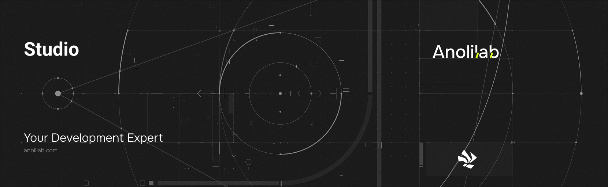

<!-- START_PACKAGE_OG_IMAGE_PLACEHOLDER -->

<a href="https://www.anolilab.com/open-source" align="center">

  

</a>

<h3 align="center">The Lunora Studio: a local admin UI for your schema, data, logs, and advisors</h3>

<!-- END_PACKAGE_OG_IMAGE_PLACEHOLDER -->

<br />

<div align="center">

[![typescript-image][typescript-badge]][typescript-url]
[![FSL-1.1-Apache-2.0 licence][license-badge]][license]
[![npm version][npm-version-badge]][npm-version]
[![npm downloads][npm-downloads-badge]][npm-downloads]
[![PRs Welcome][prs-welcome-badge]][prs-welcome]

</div>

---

<div align="center">
    <p>
        <sup>
            Daniel Bannert's open source work is supported by the community on <a href="https://github.com/sponsors/prisis">GitHub Sponsors</a>
        </sup>
    </p>
</div>

---

A local admin console for a Lunora backend: browse and edit data, run functions, read logs, inspect the schema, and review advisors. It ships as a React component library, so you can mount the whole console (`mountStudio` / `<StudioApp>`), drop in the `<Studio>` shell, or compose individual panels behind a `<LunoraProvider>`. In `lunora dev`, `@lunora/vite` serves it at `/__lunora` with no config.

Part of the [Lunora](https://github.com/anolilab/lunora) framework — a type-safe, real-time backend on Cloudflare Workers + Durable Objects with a Vite-first DX.

## Install

```sh
npm install @lunora/studio
```

```sh
yarn add @lunora/studio
```

```sh
pnpm add @lunora/studio
```

## Usage

During `lunora dev` the studio is already served at `/__lunora` by [`@lunora/vite`](https://www.npmjs.com/package/@lunora/vite) — install this package and it shows up with no extra wiring. To host it yourself, mount the batteries-included console into a `<div id="root">`:

```ts
import { mountStudio } from "@lunora/studio/mount";

const root = mountStudio({ baseUrl: "https://my-app.workers.dev" });
// root.unmount() to tear it down
```

`mountStudio` constructs a `LunoraClient`, manages the admin token, and renders the whole console. To embed in your own React tree, render `<StudioApp>` (same self-contained shell) or compose `<Studio>` and the individual panels under a `<LunoraProvider>`:

```tsx
import { LunoraClient } from "@lunora/client";
import { LunoraProvider } from "@lunora/react";
import { Studio } from "@lunora/studio";

const client = new LunoraClient({ url: "https://my-app.workers.dev" });

// `functions` populate the runner + API tabs; `kind` is a compile-time
// phantom, so it must be named here.
const functions = [
    { kind: "query", path: "messages:list" },
    { kind: "mutation", path: "messages:send" },
];

<LunoraProvider client={client}>
    <Studio dataEditable functions={functions} />
</LunoraProvider>;
```

Both surfaces are read-only until you opt in: pass `dataEditable` to allow row insert/edit/delete, and `runAsIdentity` to let the runner execute as a chosen identity (loopback-dev only — it forges identity on an admin RPC). Every admin surface stays disabled unless the worker sets `LUNORA_ADMIN_TOKEN` and the client presents a matching `Authorization: Bearer` token.

> This README covers the basics. For the full API, options, and guides, see the **[documentation](https://lunora.sh/docs/addons/studio)**.

## Related

- [`@lunora/react`](https://www.npmjs.com/package/@lunora/react) — the `<LunoraProvider>` and hooks the panels render under.
- [`@lunora/vite`](https://www.npmjs.com/package/@lunora/vite) — serves the studio at `/__lunora` during `lunora dev`.
- [`@lunora/advisor`](https://www.npmjs.com/package/@lunora/advisor) — supplies the findings the Advisors view renders.

## Supported Node.js Versions

Libraries in this ecosystem make the best effort to track [Node.js' release schedule](https://github.com/nodejs/release#release-schedule).
Here's [a post on why we think this is important](https://medium.com/the-node-js-collection/maintainers-should-consider-following-node-js-release-schedule-ab08ed4de71a).

## Contributing

If you would like to help take a look at the [list of issues](https://github.com/anolilab/lunora/issues) and check our [Contributing](https://github.com/anolilab/lunora/blob/alpha/.github/CONTRIBUTING.md) guidelines.

> **Note:** please note that this project is released with a Contributor Code of Conduct. By participating in this project you agree to abide by its terms.

## Credits

- [Daniel Bannert](https://github.com/prisis)
- [All Contributors](https://github.com/anolilab/lunora/graphs/contributors)

## Made with ❤️ at Anolilab

This is an open source project and will always remain free to use. If you think it's cool, please star it 🌟. [Anolilab](https://www.anolilab.com/open-source) is a Development and AI Studio. Contact us at [hello@anolilab.com](mailto:hello@anolilab.com) if you need any help with these technologies or just want to say hi!

## License

The Lunora studio package is open-sourced software licensed under the [FSL-1.1-Apache-2.0][license].

<!-- badges -->

[license-badge]: https://img.shields.io/badge/license-FSL--1.1--Apache--2.0-blue.svg?style=for-the-badge
[license]: https://github.com/anolilab/lunora/blob/alpha/LICENSE.md
[npm-version-badge]: https://img.shields.io/npm/v/@lunora/studio?style=for-the-badge
[npm-version]: https://www.npmjs.com/package/@lunora/studio
[npm-downloads-badge]: https://img.shields.io/npm/dm/@lunora/studio?style=for-the-badge
[npm-downloads]: https://www.npmjs.com/package/@lunora/studio
[prs-welcome-badge]: https://img.shields.io/badge/PRs-welcome-brightgreen.svg?style=for-the-badge
[prs-welcome]: https://github.com/anolilab/lunora/blob/alpha/.github/CONTRIBUTING.md
[typescript-badge]: https://img.shields.io/badge/Typescript-294E80.svg?style=for-the-badge&logo=typescript
[typescript-url]: https://www.typescriptlang.org/
