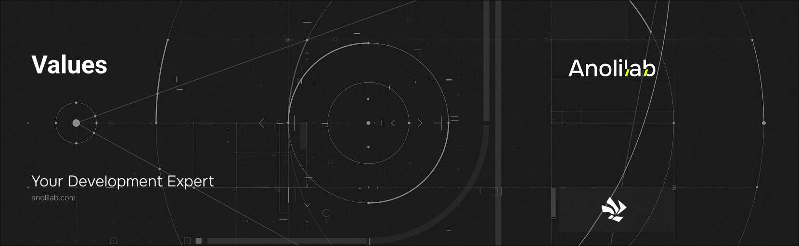

<!-- START_PACKAGE_OG_IMAGE_PLACEHOLDER -->

<a href="https://www.anolilab.com/open-source" align="center">

  

</a>

<h3 align="center">Validators for Lunora: the v.* validator suite with end-to-end return-type inference</h3>

<!-- END_PACKAGE_OG_IMAGE_PLACEHOLDER -->

<br />

<div align="center">

[![typescript-image][typescript-badge]][typescript-url]
[![FSL-1.1-Apache-2.0 licence][license-badge]][license]
[![npm version][npm-version-badge]][npm-version]
[![npm downloads][npm-downloads-badge]][npm-downloads]
[![PRs Welcome][prs-welcome-badge]][prs-welcome]

</div>

---

<div align="center">
    <p>
        <sup>
            Daniel Bannert's open source work is supported by the community on <a href="https://github.com/sponsors/prisis">GitHub Sponsors</a>
        </sup>
    </p>
</div>

---

The `v` validator namespace for Lunora — a small runtime validator suite that doubles as a schema descriptor. Every validator carries a runtime `parse` / `safeParse` plus a phantom type that `Infer<…>` reads to recover the TypeScript type end-to-end. It also speaks [Standard Schema](https://standardschema.dev) in both directions. Usually consumed transitively via [`@lunora/server`](https://www.npmjs.com/package/@lunora/server), which re-exports `v`.

Part of the [Lunora](https://github.com/anolilab/lunora) framework — a type-safe, real-time backend on Cloudflare Workers + Durable Objects with a Vite-first DX.

## Install

```sh
npm install @lunora/values
```

```sh
yarn add @lunora/values
```

```sh
pnpm add @lunora/values
```

## Usage

```ts
import { type Infer, v } from "@lunora/values";

const Message = v.object({
    id: v.id("messages"),
    body: v.string(),
    edited: v.optional(v.boolean()),
    status: v.union(v.literal("draft"), v.literal("sent")),
});

type Message = Infer<typeof Message>;
// { id: Id<"messages">; body: string; edited?: boolean; status: "draft" | "sent" }

const parsed = Message.parse(input); // throws ValidationError on mismatch

const result = Message.safeParse(input);
if (!result.ok) console.error(result.error.path, result.error.expected);
```

> This README covers the basics. For the full API, options, and guides, see the **[documentation](https://lunora.sh/docs/api/values)**.

## Related

- [`@lunora/server`](https://www.npmjs.com/package/@lunora/server) — re-exports `v` for single-import usage in your functions.
- [`@lunora/codegen`](https://www.npmjs.com/package/@lunora/codegen) — reads validator metadata to emit the typed data model.

## Supported Node.js Versions

Libraries in this ecosystem make the best effort to track [Node.js' release schedule](https://github.com/nodejs/release#release-schedule).
Here's [a post on why we think this is important](https://medium.com/the-node-js-collection/maintainers-should-consider-following-node-js-release-schedule-ab08ed4de71a).

## Contributing

If you would like to help take a look at the [list of issues](https://github.com/anolilab/lunora/issues) and check our [Contributing](https://github.com/anolilab/lunora/blob/alpha/.github/CONTRIBUTING.md) guidelines.

> **Note:** please note that this project is released with a Contributor Code of Conduct. By participating in this project you agree to abide by its terms.

## Credits

- [Daniel Bannert](https://github.com/prisis)
- [All Contributors](https://github.com/anolilab/lunora/graphs/contributors)

## Made with ❤️ at Anolilab

This is an open source project and will always remain free to use. If you think it's cool, please star it 🌟. [Anolilab](https://www.anolilab.com/open-source) is a Development and AI Studio. Contact us at [hello@anolilab.com](mailto:hello@anolilab.com) if you need any help with these technologies or just want to say hi!

## License

The Lunora values package is open-sourced software licensed under the [FSL-1.1-Apache-2.0][license].

<!-- badges -->

[license-badge]: https://img.shields.io/badge/license-FSL--1.1--Apache--2.0-blue.svg?style=for-the-badge
[license]: https://github.com/anolilab/lunora/blob/alpha/LICENSE.md
[npm-version-badge]: https://img.shields.io/npm/v/@lunora/values?style=for-the-badge
[npm-version]: https://www.npmjs.com/package/@lunora/values
[npm-downloads-badge]: https://img.shields.io/npm/dm/@lunora/values?style=for-the-badge
[npm-downloads]: https://www.npmjs.com/package/@lunora/values
[prs-welcome-badge]: https://img.shields.io/badge/PRs-welcome-brightgreen.svg?style=for-the-badge
[prs-welcome]: https://github.com/anolilab/lunora/blob/alpha/.github/CONTRIBUTING.md
[typescript-badge]: https://img.shields.io/badge/Typescript-294E80.svg?style=for-the-badge&logo=typescript
[typescript-url]: https://www.typescriptlang.org/
