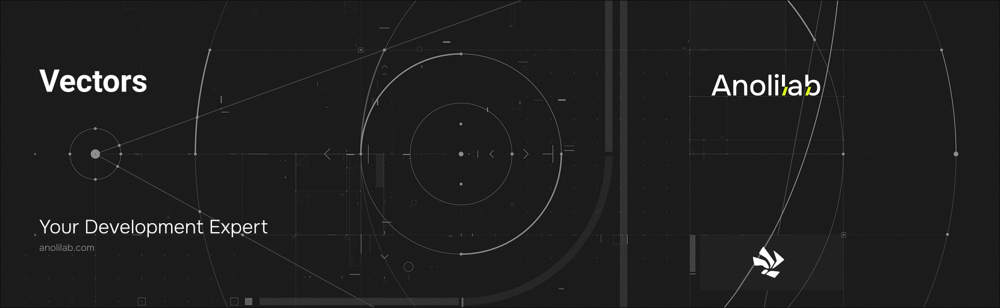

<!-- START_PACKAGE_OG_IMAGE_PLACEHOLDER -->

<a href="https://www.anolilab.com/open-source" align="center">

  

</a>

<h3 align="center">Cloudflare Vectorize adapter for Cirrus: typed vector indexes and similarity search</h3>

<!-- END_PACKAGE_OG_IMAGE_PLACEHOLDER -->

<br />

<div align="center">

[![typescript-image][typescript-badge]][typescript-url]
[![FSL-1.1-Apache-2.0 licence][license-badge]][license]
[![npm version][npm-version-badge]][npm-version]
[![npm downloads][npm-downloads-badge]][npm-downloads]
[![PRs Welcome][prs-welcome-badge]][prs-welcome]

</div>

---

<div align="center">
    <p>
        <sup>
            Daniel Bannert's open source work is supported by the community on <a href="https://github.com/sponsors/prisis">GitHub Sponsors</a>
        </sup>
    </p>
</div>

---

A Cloudflare Vectorize adapter for Cirrus. Declare typed vector indexes alongside your regular tables, keep them automatically in sync on every write, and run similarity search from any function handler. You bring your own embedder; `@cirrus/vectors` handles the Vectorize binding plumbing, batching, concurrency limits, and delete propagation.

Part of the [Cirrus](https://github.com/anolilab/cirrus) framework — a type-safe, real-time backend on Cloudflare Workers + Durable Objects with a Vite-first DX.

## Install

```sh
npm install @cirrus/vectors
```

```sh
yarn add @cirrus/vectors
```

```sh
pnpm add @cirrus/vectors
```

## Usage

```ts
// cirrus/schema.ts — declare a vector index inline on the table
import { defineSchema, defineTable, v } from "@cirrus/server";
import { embed } from "../app/embed"; // your own embedder

export default defineSchema({
    docs: defineTable({
        title: v.string(),
        body: v.string(),
        workspaceId: v.id("workspaces"),
    })
        .shardBy("workspaceId")
        .vectorize("body", { index: "docs-body", dimensions: 1024, metric: "cosine", embed }),
});

// cirrus/searchDocs.ts — query from a handler via ctx.vectors
import { query, v } from "@cirrus/server";

export const searchDocs = query({
    args: { q: v.string() },
    handler: async (ctx, { q }) => {
        const { matches } = await ctx.vectors.query("docs-body", { input: q, embed, topK: 10 });

        return matches.map((m) => m.id);
    },
});
```

> This README covers the basics. For the full API, options, and guides, see the **[documentation](https://cirrus.dev/docs)**.

## Related

- [`@cirrus/server`](https://www.npmjs.com/package/@cirrus/server) — schema primitives that declare the indexes (`.vectorize`, `defineVectorIndex`).
- [`@cirrus/do`](https://www.npmjs.com/package/@cirrus/do) — Durable Objects that run the write-sync hooks and function contexts.
- [`@cirrus/vite`](https://www.npmjs.com/package/@cirrus/vite) — validates that every declared index has a matching `[[vectorize]]` binding.

## Supported Node.js Versions

Libraries in this ecosystem make the best effort to track [Node.js' release schedule](https://github.com/nodejs/release#release-schedule).
Here's [a post on why we think this is important](https://medium.com/the-node-js-collection/maintainers-should-consider-following-node-js-release-schedule-ab08ed4de71a).

## Contributing

If you would like to help take a look at the [list of issues](https://github.com/anolilab/cirrus/issues) and check our [Contributing](https://github.com/anolilab/cirrus/blob/alpha/.github/CONTRIBUTING.md) guidelines.

> **Note:** please note that this project is released with a Contributor Code of Conduct. By participating in this project you agree to abide by its terms.

## Credits

- [Daniel Bannert](https://github.com/prisis)
- [All Contributors](https://github.com/anolilab/cirrus/graphs/contributors)

## Made with ❤️ at Anolilab

This is an open source project and will always remain free to use. If you think it's cool, please star it 🌟. [Anolilab](https://www.anolilab.com/open-source) is a Development and AI Studio. Contact us at [hello@anolilab.com](mailto:hello@anolilab.com) if you need any help with these technologies or just want to say hi!

## License

The Cirrus vectors package is open-sourced software licensed under the [FSL-1.1-Apache-2.0][license].

<!-- badges -->

[license-badge]: https://img.shields.io/badge/license-FSL--1.1--Apache--2.0-blue.svg?style=for-the-badge
[license]: https://github.com/anolilab/cirrus/blob/alpha/LICENSE.md
[npm-version-badge]: https://img.shields.io/npm/v/@cirrus/vectors?style=for-the-badge
[npm-version]: https://www.npmjs.com/package/@cirrus/vectors
[npm-downloads-badge]: https://img.shields.io/npm/dm/@cirrus/vectors?style=for-the-badge
[npm-downloads]: https://www.npmjs.com/package/@cirrus/vectors
[prs-welcome-badge]: https://img.shields.io/badge/PRs-welcome-brightgreen.svg?style=for-the-badge
[prs-welcome]: https://github.com/anolilab/cirrus/blob/alpha/.github/CONTRIBUTING.md
[typescript-badge]: https://img.shields.io/badge/Typescript-294E80.svg?style=for-the-badge&logo=typescript
[typescript-url]: https://www.typescriptlang.org/
