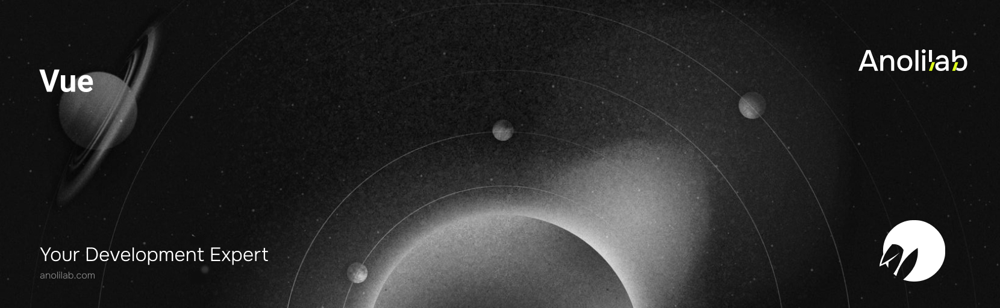

<!-- START_PACKAGE_OG_IMAGE_PLACEHOLDER -->

<a href="https://www.anolilab.com/open-source" align="center">

  

</a>

<h3 align="center">Vue adapter for Lunora — live composables, optimistic mutations, and reactive loaders</h3>

<!-- END_PACKAGE_OG_IMAGE_PLACEHOLDER -->

<br />

<div align="center">

[![typescript-image][typescript-badge]][typescript-url]
[![FSL-1.1-Apache-2.0 licence][license-badge]][license]
[![npm version][npm-version-badge]][npm-version]
[![npm downloads][npm-downloads-badge]][npm-downloads]
[![PRs Welcome][prs-welcome-badge]][prs-welcome]

</div>

---

<div align="center">
    <p>
        <sup>
            Daniel Bannert's open source work is supported by the community on <a href="https://github.com/sponsors/prisis">GitHub Sponsors</a>
        </sup>
    </p>
</div>

---

The Vue adapter for Lunora. Thin, idiomatic glue over the framework-neutral `@lunora/client` (WebSocket transport, subscription registry, offline queue, delta-merge), re-expressed as Vue composables. Live queries and optimistic mutations behave like any other reactive source, with a `hydratePreloaded` handoff for SSR.

Part of the [Lunora](https://github.com/anolilab/lunora) framework — a type-safe, real-time backend on Cloudflare Workers + Durable Objects with a Vite-first DX.

## Install

```sh
npm install @lunora/vue
```

```sh
yarn add @lunora/vue
```

```sh
pnpm add @lunora/vue
```

## Usage

```ts
import { createApp } from "vue";
import { LunoraClient } from "@lunora/client";
import { createLunora, useQuery, useMutation } from "@lunora/vue";
import { api } from "./lunora/_generated/api";
import App from "./App.vue";

// Provide the client once at the app root.
const client = new LunoraClient({ url: "https://app.acme.test" });
createApp(App).use(createLunora(client)).mount("#app");

// Inside a component's <script setup>:
const messages = useQuery(api.messages.list, () => ({ room: "general" }));
const { mutate, pending } = useMutation(api.messages.send);
```

> This README covers the basics. For the full API, options, and guides, see the **[documentation](https://lunora.sh/docs/frameworks/bring-your-framework)**.

## API

| Composable            | React equivalent      | Description                                                                       |
| --------------------- | --------------------- | --------------------------------------------------------------------------------- |
| `createLunora`        | `LunoraProvider`      | Vue plugin — call `app.use(createLunora(client))` at the app root.                |
| `useLunora`           | `useLunora`           | Inject the ambient `LunoraClient` from the nearest provider.                      |
| `useQuery`            | `useQuery`            | Live query `ShallowRef` — re-subscribes when reactive args change.                |
| `useMutation`         | `useMutation`         | Optimistic mutation handle (`data`, `error`, `pending`, `mutate`, `reset`).       |
| `useSubscription`     | `useSubscription`     | Raw subscription `ShallowRef` — unbounded live stream.                            |
| `usePaginatedQuery`   | `usePaginatedQuery`   | Cursor-paginated query with `loadMore`, `status`, `results`, and `error`.         |
| `useInfiniteQuery`    | `useInfiniteQuery`    | Infinite-scroll variant of `usePaginatedQuery`.                                   |
| `useAuth`             | `useAuth`             | Reactive auth: readonly `token`/`user` refs plus `setToken`.                      |
| `usePresence`         | `usePresence`         | Collaborative-awareness — heartbeat + live present-members `ShallowRef`.          |
| `useFlag`             | `useFlag`             | Live OpenFeature flag as a readonly `Ref` — holds `default` until resolved.       |
| `useFlags`            | `useFlags`            | Batch variant — a readonly `Ref` of one value per key in the defaults map.        |
| `useRateLimit`        | `useRateLimit`        | Client-side rate-limit mirror — `ok`, `disabled`, `retryAfter` as ComputedRefs.   |
| `useConnectionStatus` | `useConnectionStatus` | Reactive connection state (`idle`, `connecting`, `connected`, `offline`).         |
| `hydratePreloaded`    | `usePreloadedQuery`   | Seed a query synchronously from an SSR `Preloaded` token, then go live.           |
| `useAgentToolEvents`  | `useAgentToolEvents`  | One agent thread's tool lifecycle as a `ComputedRef` of discriminated events.     |
| `useVoiceAgent`       | `useVoiceAgent`       | Full-duplex voice call — refs for status/transcript/level, `startCall`/`endCall`. |

`useVoiceAgent` opens nothing until `startCall()` — that call is what requests the microphone, so it must run from a user gesture. `endCall()` releases the socket, the mic tracks and the Web Audio graph, and `onScopeDispose` runs it for you on unmount.

## Related

- [`@lunora/client`](https://www.npmjs.com/package/@lunora/client) — the framework-neutral browser SDK this adapter wraps.
- `@lunora/client/ssr` — the server preload contract behind `@lunora/vue/server`.
- [`@lunora/react`](https://www.npmjs.com/package/@lunora/react) — the same contract for React.

## Supported Node.js Versions

Libraries in this ecosystem make the best effort to track [Node.js' release schedule](https://github.com/nodejs/release#release-schedule).
Here's [a post on why we think this is important](https://medium.com/the-node-js-collection/maintainers-should-consider-following-node-js-release-schedule-ab08ed4de71a).

## Contributing

If you would like to help take a look at the [list of issues](https://github.com/anolilab/lunora/issues) and check our [Contributing](https://github.com/anolilab/lunora/blob/alpha/.github/CONTRIBUTING.md) guidelines.

> **Note:** please note that this project is released with a Contributor Code of Conduct. By participating in this project you agree to abide by its terms.

## Credits

- [Daniel Bannert](https://github.com/prisis)
- [All Contributors](https://github.com/anolilab/lunora/graphs/contributors)

## Made with ❤️ at Anolilab

This is an open source project and will always remain free to use. If you think it's cool, please star it 🌟. [Anolilab](https://www.anolilab.com/open-source) is a Development and AI Studio. Contact us at [hello@anolilab.com](mailto:hello@anolilab.com) if you need any help with these technologies or just want to say hi!

## License

The Lunora vue package is open-sourced software licensed under the [FSL-1.1-Apache-2.0][license].

<!-- badges -->

[license-badge]: https://img.shields.io/badge/license-FSL--1.1--Apache--2.0-blue.svg?style=for-the-badge
[license]: https://github.com/anolilab/lunora/blob/alpha/LICENSE.md
[npm-version-badge]: https://img.shields.io/npm/v/@lunora/vue?style=for-the-badge
[npm-version]: https://www.npmjs.com/package/@lunora/vue
[npm-downloads-badge]: https://img.shields.io/npm/dm/@lunora/vue?style=for-the-badge
[npm-downloads]: https://www.npmjs.com/package/@lunora/vue
[prs-welcome-badge]: https://img.shields.io/badge/PRs-welcome-brightgreen.svg?style=for-the-badge
[prs-welcome]: https://github.com/anolilab/lunora/blob/alpha/.github/CONTRIBUTING.md
[typescript-badge]: https://img.shields.io/badge/Typescript-294E80.svg?style=for-the-badge&logo=typescript
[typescript-url]: https://www.typescriptlang.org/
